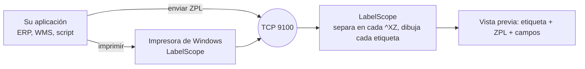

<p align="center">
  🌎 <a href="README.md">English</a> · <strong>Español</strong> · <a href="README.pt-BR.md">Português</a> · <a href="README.fr.md">Français</a>
</p>

<p align="center">
  
</p>

<h1 align="center">LabelScope</h1>

<p align="center">
  <strong>Una impresora de etiquetas Zebra® virtual para Windows.</strong><br>
  Envíe ZPL desde cualquier programa. Vea la etiqueta en pantalla, encuentre los problemas y ahorre papel.
</p>

<p align="center">
  <a href="https://github.com/P4Software/LabelScope/releases/latest"></a>
  <a href="LICENSE"></a>
  
  <a href="https://github.com/P4Software/LabelScope/releases"></a>
</p>

<p align="center">
  <a href="https://github.com/P4Software/LabelScope/releases/latest/download/LabelScope-Setup.exe"><strong>Descargar LabelScope-Setup.exe</strong></a>
  &nbsp;·&nbsp;
  <a href="https://github.com/P4Software/LabelScope/releases/latest">Todas las versiones</a>
  <br>
  <sub>Versión 0.4.1 · Windows 10 u 11 de 64 bits · gratis · no hacen falta permisos de administrador para instalar</sub>
</p>

---

## Por qué LabelScope

**Vea cada etiqueta antes de que se imprima.**
Los sistemas de almacén, envíos y tiendas imprimen etiquetas enviando texto ZPL a una impresora Zebra. LabelScope se hace pasar por esa impresora. Su etiqueta aparece en pantalla en segundos, junto al ZPL que la dibujó. Sin rollo de etiquetas y sin papel desperdiciado.

**Detecte los problemas antes de que le cuesten.**
Un código de barras que se sale del borde de la etiqueta no se podrá escanear. LabelScope lo marca en rojo y le explica por qué, con palabras sencillas. Cada comando que no puede dibujar aparece en la lista con su número de línea, en lugar de fallar en silencio.

**Funciona sin internet. Gratis. Firmado.**
Las etiquetas se dibujan en su PC. No se sube nada y no se cobra por uso. El instalador está firmado digitalmente, es gratuito bajo la licencia MIT y no necesita permisos de administrador.

---

## Qué obtiene

### Haga clic en un campo y encuentre su línea de ZPL

La pestaña **Campos** muestra todo lo que LabelScope dibujó: textos, códigos de barras, recuadros, círculos, líneas y gráficos, cada uno con su posición, tamaño, fuente y línea de ZPL. Haga clic en un campo de la etiqueta, en una fila de la lista o en una línea de ZPL, y los tres seleccionan lo mismo.

<p align="center">
  
</p>

### Sepa cuándo un código de barras no se podrá escanear

Cuando un código de barras se sale de la etiqueta, LabelScope lo rodea con un contorno rojo y dice, con palabras sencillas, qué está mal, qué hacer y qué línea es la responsable. La tarjeta del trabajo a la izquierda también se pone roja, así que lo ve antes de abrir la etiqueta.

<p align="center">
  
</p>

### Configúrelo una vez, en una sola pantalla

**Configurar impresora** reúne lo que casi todo el mundo necesita: el nombre de la impresora de Windows con un botón **Reinstalar impresora**, el tamaño de etiqueta (nueve tamaños comunes o el suyo en milímetros), la densidad de impresión (203, 300 o 600 ppp), el idioma, si el trabajo más reciente se muestra al llegar y si los trabajos se conservan al cerrar LabelScope.

<p align="center">
  
</p>

### En español, inglés, portugués y francés

Elija English, Español, Português (Brasil) o Français en la barra de herramientas, o deje que LabelScope siga el idioma de Windows. Cambian todos los textos, incluidos los avisos y los mensajes que explican qué salió mal y qué hacer a continuación. Los trabajos que ya están en pantalla se dibujan de nuevo en el idioma elegido.

<p align="center">
  
</p>

### Cada trabajo de impresión, una tarjeta

Cada envío de su sistema se convierte en una tarjeta, la más reciente primero, con la hora, el remitente, el número de etiquetas y "Generada correctamente" o el primer problema. Un trabajo con varias etiquetas muestra *Etiqueta 1 de 3* con flechas para recorrerlas. Active **Conservar los trabajos al cerrar LabelScope** y su lista seguirá ahí mañana.

<p align="center">
  
</p>

### Y además

- **Etiqueta y ZPL lado a lado**, con los comandos en color y números de línea. La pestaña **Registro** anota qué pasó con cada trabajo.
- **Abrir archivo ZPL** y **Pegar ZPL** para revisar una etiqueta sin enviar nada.
- **El tamaño de la etiqueta viene primero del ZPL.** `^PW` y `^LL` mandan; si la etiqueta no envía ninguno, LabelScope usa el tamaño que envió un trabajo anterior y, si no, la etiqueta cargada en Configurar impresora (también en la lista de tamaños de la barra de herramientas).
- **Guardar como PNG** o copiar la etiqueta como imagen. El tamaño de la etiqueta se muestra en pulgadas y puntos.
- **Memoria de impresora** como en una impresora real: los gráficos, fuentes y ajustes enviados en un trabajo están disponibles para el siguiente.
- **Actualización dentro de la aplicación** y un **registro de errores graves** (crash log) si algo sale mal.

---

## Inicio rápido en 60 segundos

1. **[Descargue LabelScope-Setup.exe](https://github.com/P4Software/LabelScope/releases/latest/download/LabelScope-Setup.exe)** y ejecútelo. Se instala solo para su usuario.
2. Abra **LabelScope** desde el menú Inicio.
3. Abra **Configurar impresora** y pulse **Reinstalar impresora**, o use el menú **...** y elija **Instalar impresora**. Responda **Sí** cuando Windows lo pregunte. Es el único paso que necesita permiso de administrador.
4. Imprima desde cualquier programa en la impresora llamada **LabelScope**, o envíe ZPL a `127.0.0.1` puerto `9100`.
5. El trabajo aparece a la izquierda y la etiqueta en el centro. Haga clic en él, haga clic en un campo, lea el ZPL.

¿No tiene ZPL a mano? Pulse **Pegar ZPL** y pegue esto:

```zpl
^XA
^FX Shipping label
^PW812^LL406
^FO50,50^A0N,60,60^FDHello LabelScope^FS
^FO50,140^GB700,4,4^FS
^FO50,180^BY3^BCN,100,Y,N,N^FD12345678^FS
^XZ
```

O envíelo desde PowerShell:

```powershell
$zpl = "^XA^FO50,50^A0N,60,60^FDHello LabelScope^FS^FO50,150^GB400,4,4^FS^XZ"
$client = New-Object Net.Sockets.TcpClient("127.0.0.1", 9100)
$bytes = [Text.Encoding]::UTF8.GetBytes($zpl)
$client.GetStream().Write($bytes, 0, $bytes.Length)
$client.Close()
```

Para quitar la impresora más adelante, use **Quitar impresora** en el menú **...**. LabelScope solo quita una impresora que haya creado él mismo.

---

## Cómo funciona



- La impresora de Windows usa el controlador **Generic / Text Only** que viene con Windows, así que en los trabajos de impresión en bruto el ZPL llega a LabelScope intacto.
- Los programas que pueden hablar TCP se saltan la impresora y envían directamente al puerto **9100**, el puerto estándar de las impresoras de etiquetas en red.
- El dibujo se hace **dentro de LabelScope**. No hay ningún servicio en línea.

---

## ZPL compatible

LabelScope dibuja lo que entiende y **le avisa de todo lo demás**. El objetivo de las próximas versiones es la compatibilidad completa con ZPL.

| Grupo | Comandos |
|---|---|
| Etiqueta y campos | `^XA ^XZ ^PW ^LL ^LH ^LR ^PO ^PQ ^FO ^FT ^FD ^FS ^FW ^FH ^FB ^FR ^FX ^CF` |
| Juegos de caracteres | `^CI`: `^CI28` (UTF-8) y los otros juegos Unicode 29 y 30 se dibujan como los imprime una impresora. `^CI0` a `^CI27` y 31 a 36 son exactos para texto ASCII simple |
| Texto y fuentes | `^A` con las fuentes `0`, `A` a `H` y `P` a `V`; `^A@` y `^CW` con sus propias fuentes |
| Formas | `^GB ^GC ^GD` |
| Códigos de barras | `^BY ^BC ^B3 ^BL ^BA ^BE ^BU ^B8 ^B9 ^B2 ^BK ^B1 ^BM ^BQ ^BX ^B7`: Code 128, Code 39, LOGMARS, Code 93, EAN-13, UPC-A, EAN-8, UPC-E, Interleaved 2 of 5, Codabar, Code 11, MSI, QR Code, Data Matrix, PDF417 |
| Gráficos | `^GF` (hexadecimal ASCII, compresión Zebra, Z64, B64), `~DG ~DY ^XG ^IM ^IL ^IS ^ID ~DN` |

**Todavía no.** Estos muestran un aviso y se omiten, y son los primeros de la fila para la próxima versión:

- Formatos almacenados y contadores: `^DF` / `^XF`, `^SN`, `^FV`.
- Juegos de caracteres: las letras acentuadas y otras letras no ASCII en las páginas de códigos de un byte (`^CI0` a `^CI27`, 31 a 36, como CP850) todavía se están completando. Una etiqueta así muestra un aviso que nombra el juego.
- Códigos de barras: `^BI ^BJ ^BP ^BS ^B5 ^BZ ^BR ^BD ^B0 ^BO ^B4 ^BB ^BT ^BF` (industrial 2 of 5, Plessey, complementos, códigos postales, GS1 DataBar, MaxiCode, Aztec, Code 49, CODABLOCK, TLC39, MicroPDF417).
- Gráficos: datos binarios (`^GF` y `~DY` formato B), la compresión AR de Zebra (formato C), fuentes de mapa de bits descargables (`~DB`). `~EG` muestra un aviso; use `^ID`.

Algunos comandos que cambian el comportamiento de la impresora pero no la imagen (`^MN ^MM ^MD ^MT ^PR ^JU`) se ignoran sin aviso.

### Límites que conviene conocer

- **Las fuentes son aproximadas en forma y exactas en tamaño.** Las fuentes propias de Zebra tienen licencia y no se pueden distribuir, así que LabelScope dibuja las fuentes A a H con los tamaños de celda de Zebra, y la fuente 0 y P a V con Noto Sans ExtraCondensed Bold colocada y dimensionada como la fuente 0 de Zebra. Las mayúsculas empiezan en la línea de `^FO` y tienen la misma altura que en una impresora, y el largo de las líneas queda dentro de un 2 % aproximadamente. La forma de las letras es distinta. Las fuentes OCR E y H se dibujan con una fuente sencilla de ancho fijo. Los caracteres que una fuente no tiene se imprimen como espacios, con un aviso. LabelScope es una herramienta de vista previa, no un reemplazo exacto al píxel de una impresora.
- **Los códigos de barras y los gráficos se dibujan según las reglas publicadas y todavía no se han comparado con una impresora Zebra real.** Se decodifican correctamente con un decodificador independiente, pero pueden variar pequeños detalles: el margen en blanco alrededor de un símbolo, el tamaño elegido para PDF417 cuando la etiqueta no indica columnas ni filas, o el tamaño de los dígitos bajo EAN/UPC. En PDF417 la altura de fila (`h`) se toma en puntos; una impresora puede multiplicarla por el ancho de módulo. Pruebe siempre a escanear una etiqueta importante en su impresora real.
- **La memoria de impresora dura mientras LabelScope está abierto.** Los gráficos y fuentes enviados con `~DG`, `~DY` o `^IS`, y las letras de fuente asignadas con `^CW`, se conservan, como en la unidad R: de una impresora, hasta que cierre LabelScope o pulse **Borrar memoria de impresora** (en el menú **...**), hasta 64 MB o 1000 objetos. Una etiqueta que usa un gráfico que LabelScope nunca recibió se dibuja sin él, con un aviso que nombra el archivo.
- **El tamaño de la etiqueta viene del ZPL.** El ancho es `^PW` y el largo es `^LL`, de la propia etiqueta o de un trabajo anterior; los programas de etiquetas suelen enviarlos una vez en un trabajo de configuración, y LabelScope los conserva (con `^LH`, `^PO` y `^LR`) como lo hace una impresora. Cuando el ZPL nunca da un tamaño, LabelScope usa la etiqueta cargada en Configurar impresora o elegida en la lista de tamaños de la barra de herramientas (4 x 6 pulg. a 203 ppp al principio). El tamaño está limitado a 8000 puntos por lado y 40 millones de puntos en total, con un aviso.
- **`^BY`, `^FW` y `^CF` se aplican a una sola etiqueta.** Cada etiqueta empieza con los ajustes de impresora iniciales, así que repita el comando en cada etiqueta que lo necesite.
- **Datos gráficos binarios y separación de trabajos.** LabelScope separa un envío en cada `^XZ`, incluso dentro de datos gráficos binarios. Por ahora, envíe los gráficos en hexadecimal ASCII o Z64.
- **`^GF` se pinta donde está escrito.** Un `^FR` escrito después de `^GF` en el mismo campo no lo invierte; ponga `^FR` antes de `^GF`.
- **No se verifica el valor de comprobación de los gráficos Z64 y B64.** Zebra no publica el método. Los datos Z64 se siguen comprobando con la suma de verificación de su propia compresión y con su tamaño.
- **Detalles de los códigos de barras.** Data Matrix con calidad 0 a 140 se dibuja como el tipo moderno ECC 200, con un aviso. Los identificadores de aplicación GS1 en el modo D de Code 128 no se validan. Los datos QR con letras acentuadas se envían como Latin-1 cuando todos los caracteres caben, mientras que una impresora configurada en UTF-8 envía UTF-8; ambos se escanean, pero los bytes leídos pueden diferir.
- **Codificación del texto.** Cada etiqueta se lee primero como UTF-8 y, si no es UTF-8 válido, como Windows-1252. Las etiquetas con `^CI28` dibujan las letras acentuadas exactamente. Con un juego `^CI` de un byte, el texto ASCII simple es exacto; otras letras pueden diferir de la impresora y la etiqueta lo indica con un aviso. Una etiqueta que anuncia `^CI28` pero no envía UTF-8 también recibe un aviso.
- **Velocidad.** Las etiquetas habituales aparecen al instante, y un envío de 5000 etiquetas se dibuja en unos 16 segundos. Una etiqueta que coloca decenas de gráficos de tamaño completo puede tardar varios segundos. Un campo de texto de más de 65536 caracteres se corta, con un aviso. Una sola etiqueta de más de 16 MB sin `^XZ` se descarta, con un mensaje.
- **Las esquinas redondeadas de `^GB` se dibujan rectas**, con un aviso.

---

## Configurar impresora y configuración

Abra **Configurar impresora** en la barra de herramientas. Pulse **Guardar** y el cambio se aplica de inmediato; el tamaño, la densidad y el idioma vuelven a dibujar los trabajos que ya están en pantalla.

| Opción | Qué hace |
|---|---|
| Nombre de la impresora | El nombre de la impresora de Windows. Como máximo 60 caracteres, sin `* ? [ ] \ / !`. Un nombre nuevo se aplica cuando pulsa **Reinstalar impresora**. |
| Tamaño de etiqueta | Nueve tamaños comunes, o **Personalizado** en milímetros (5 a 2000). Solo se usa cuando el ZPL no da `^PW` / `^LL`. |
| Densidad de impresión | 203, 300 o 600 ppp. |
| Idioma | Idioma de Windows, inglés, español, portugués (Brasil) o francés. |
| Mostrar el trabajo más reciente al llegar | Activado de forma predeterminada. Desactívelo para seguir viendo el trabajo que seleccionó. |
| Conservar los trabajos al cerrar LabelScope | Desactivado de forma predeterminada. Si está activado, sus trabajos vuelven en el siguiente inicio (se guardan en `%LocalAppData%\LabelScope`). |

LabelScope marca la impresora que crea. Nunca cambia ni quita una impresora que no creó, aunque tenga el mismo nombre. La impresora reenvía a `127.0.0.1` en el puerto de escucha, así que si cambia el puerto, reinstale la impresora.

### Avanzado: settings.json

`settings.json` está junto al programa y se crea en el primer inicio con una explicación para cada opción. Si un valor es incorrecto, LabelScope usa un valor predeterminado seguro y le dice qué ajuste corregir. El archivo puede contener comentarios `//`. Edítelo solo para las claves siguientes y luego reinicie LabelScope.

| Ajuste | Predeterminado | Significado |
|---|---|---|
| `ListenAddress` | `127.0.0.1` | `127.0.0.1` acepta etiquetas solo de este equipo; `0.0.0.0` también las acepta de la red. No se acepta ningún otro valor. |
| `ListenPort` | `9100` | Puerto para el ZPL entrante, de 1 a 65535. Cámbielo si otro programa ya usa el 9100. |
| `HistoryLimit` | `100` | Cuántos trabajos conservar en la lista, de 1 a 1000. |
| `FontsFolder` | vacío | Carpeta con sus propias fuentes TrueType (`.ttf`) u OpenType (`.otf`). Una etiqueta que nombra un archivo de fuente con `^A@` o `^CW` (por ejemplo `E:ARIAL.TTF`) usa el archivo con ese nombre de esta carpeta. |
| `LogFolder` | `logs` | Dónde se escriben los archivos de registro. Una carpeta relativa es relativa a la carpeta del programa. |
| `CheckForUpdates` | `true` | Pregunta a GitHub una vez al iniciar si existe una versión más nueva. LabelScope solo se lo dice; instala una versión nueva cuando usted pulsa **Actualizar**. |
| `ShowGrid` / `StackedLayout` | `false` | Empezar con una cuadrícula ligera de 10 mm sobre la etiqueta, o con el ZPL debajo de la imagen. También en el menú **...**. |

Mantenga LabelScope en una carpeta en la que pueda escribir, como la que usa el instalador, y no en `Program Files` si ejecuta una compilación copiada: escribe `settings.json` y su carpeta `logs` junto a sí mismo. Escuchar en `0.0.0.0` puede hacer que Windows muestre un aviso del firewall, y responderlo requiere un administrador.

---

## Preguntas frecuentes y solución de problemas

| Problema | Qué hacer |
|---|---|
| "El puerto 9100 ya lo usa otro programa" | Otro programa (o un segundo LabelScope) usa el puerto. Ciérrelo, o ponga otro `ListenPort` en `settings.json`, vuelva a iniciar LabelScope y reinstale la impresora. La línea de estado muestra el problema en rojo hasta que se resuelva. |
| "LabelScope no pudo empezar a escuchar en ..." | Revise `ListenAddress` y `ListenPort` en `settings.json`. |
| "Windows pidió permiso y no se concedió, así que no se cambió nada" | Se rechazó la pregunta de Windows. Inténtelo de nuevo y elija **Sí**. |
| "Ya existe una impresora llamada ... que no fue creada por LabelScope" | LabelScope no toca impresoras que no creó. Elija otro nombre en **Configurar impresora**. |
| "No se pudo instalar la impresora: ..." o "no pudo comprobar qué impresoras están instaladas" | Compruebe que el servicio "Cola de impresión" (Print Spooler) de Windows esté en ejecución e inténtelo de nuevo. Si sigue fallando, muestre el mensaje a su administrador. Los detalles están en el registro. |
| Un trabajo titulado "No se encontró ninguna etiqueta" | Los datos que llegaron no tenían un bloque `^XA ... ^XZ` (por ejemplo una consulta de estado, o un documento normal impreso en la impresora LabelScope). El texto se muestra en la pestaña ZPL. |
| Un trabajo titulado "Etiqueta no dibujada" | Los datos tenían un inicio de etiqueta (`^XA`) pero no se pudo dibujar nada a partir de ellos. Revise la pestaña **Registro**. |
| Un código de barras tiene un contorno rojo | Se sale de la etiqueta o es demasiado ancho para su espacio, así que no se podrá escanear. Muévalo, acorte los datos o use un ancho de módulo menor en `^BY`. |
| "LabelScope está ocupado: demasiados programas envían etiquetas a la vez" | Había más de 16 programas conectados al mismo tiempo. Espere un momento y vuelva a enviar. |
| "No se pudo leer el archivo de configuración ..." | Hay un error de escritura en `settings.json`. Corríjalo, o bórrelo para obtener uno nuevo, y reinicie. Mientras tanto se usa la configuración estándar. |
| "Se recibió una etiqueta de más de 16 MB sin marca de fin (^XZ) y se descartó" | El remitente no está enviando etiquetas reales, o nunca envía `^XZ`. Revise el programa que envía las etiquetas. |
| "Una etiqueta llegó incompleta (sin ^XZ al final)" | El remitente se desconectó antes de enviar `^XZ`. La etiqueta se muestra hasta donde llegó. |
| Una etiqueta se ve distinta que en la impresora real | Las fuentes son aproximadas en forma y algunos comandos todavía no son compatibles. Revise la pestaña **Registro**. |
| LabelScope se cerró solo, o mostró "LabelScope encontró un error inesperado" | Los detalles técnicos están en `crash.log`, en la carpeta `logs` junto al programa, o en `%LocalAppData%\LabelScope\logs` si esa carpeta es de solo lectura. El archivo puede contener rutas de archivos, incluido su nombre de usuario de Windows, así que revíselo antes de enviarlo por correo. |
| Otra cosa | Abra el menú **...**, elija **Abrir carpeta de registros** y mire el archivo más reciente. |

---

## Privacidad y seguridad

- Las etiquetas se dibujan localmente y nunca salen de su equipo. La única solicitud a internet que hace LabelScope es una pequeña pregunta a GitHub al iniciar ("¿hay una versión más nueva?"). No envía nada sobre usted ni sobre sus etiquetas. Ponga `CheckForUpdates` en `false` para desactivar incluso eso.
- De forma predeterminada, LabelScope escucha solo en `127.0.0.1`, así que otros equipos no pueden llegar a él. Ponga `ListenAddress` en `0.0.0.0` solo en redes de confianza: cualquiera que llegue al puerto puede enviarle etiquetas.
- El programa nunca se ejecuta como administrador. Solo instalar o quitar la impresora pide permiso a Windows.
- LabelScope nunca cambia ni quita una impresora que no creó.
- El instalador está firmado digitalmente. Antes de ejecutar una actualización descargada se comprueba la firma del editor.
- Si activa **Conservar los trabajos al cerrar**, el ZPL de sus trabajos se guarda en un archivo en su PC. Desactívelo si las etiquetas contienen datos que no quiere guardar.

---

## Compilar desde el código fuente

Necesita Windows 10 u 11 y el [SDK de .NET 10](https://dotnet.microsoft.com/download/dotnet/10.0) o uno más nuevo.

```powershell
git clone https://github.com/P4Software/LabelScope.git
cd LabelScope
dotnet build
dotnet run --project src/LabelScope.App
```

Si la restauración de paquetes falla porque un origen de NuGet está dañado o no responde, agregue el origen público:

```powershell
dotnet build -p:RestoreSources=https://api.nuget.org/v3/index.json
```

Compilación autocontenida (no hay que instalar nada en el equipo de destino):

```powershell
dotnet publish src/LabelScope.App -c Release -r win-x64 --self-contained -o publish/win-x64
```

Copie `publish/win-x64` a cualquier PC con Windows 10 u 11 y haga doble clic en `LabelScope.exe`.

```
src/LabelScope.Core/    Configuración, receptor TCP, analizador y dibujo de ZPL, instalador de impresora (sin interfaz)
src/LabelScope.App/     La aplicación de Windows (WPF)
installer/              Script de Inno Setup y la compilación que crea y firma el instalador
assets/                 Logotipo, icono y capturas de pantalla
```

---

## Hoja de ruta

- [x] **0.2.0** Códigos de barras y texto girado
- [x] **0.3.0** Gráficos, imágenes y fuentes propias; instalador firmado
- [x] **0.4.0** Ventana nueva, pestaña Campos, aviso en rojo para códigos de barras que no se podrán escanear, interfaz completa en español, Configurar impresora, conservar trabajos
- [x] **0.4.1** Portugués (Brasil) y francés
- [ ] **0.5** ZPL completo: las páginas de códigos `^CI` restantes, `^DF` / `^XF`, `^SN`, `^FV`, los códigos de barras restantes, gráficos binarios
- [ ] Comparación de códigos de barras y gráficos con una impresora Zebra real
- [ ] Opcional: guardar automáticamente cada etiqueta recibida en archivos PDF o de imagen

---

## Contribuir

Los informes de errores y las solicitudes de funciones son bienvenidos en [Issues](https://github.com/P4Software/LabelScope/issues). El informe más útil incluye el ZPL que se dibuja mal (quite antes cualquier dato privado) y, si puede, una foto de lo que imprime su impresora.

---

## Licencia y créditos

LabelScope es software libre de [P4 Software](https://github.com/P4Software) bajo la [licencia MIT](LICENSE): puede usarlo, copiarlo, modificarlo y compartirlo, también en trabajos comerciales, siempre que el aviso de copyright y el texto de la licencia lo acompañen.

Usa SkiaSharp, Serilog, ZXing.Net, AvalonEdit y el runtime de .NET, y da crédito a la biblioteca generadora de códigos QR de Project Nayuki. Las fuentes integradas de Zebra se dibujan con las fuentes incluidas Noto Sans ExtraCondensed Bold e IBM Plex Mono (SIL Open Font License 1.1). Todas las licencias y avisos de copyright están en [THIRD-PARTY-NOTICES.txt](THIRD-PARTY-NOTICES.txt), que también se instala junto a `LabelScope.exe`.

Zebra® y ZPL® son marcas comerciales de Zebra Technologies Corporation. LabelScope es un producto independiente y no está afiliado a Zebra Technologies ni cuenta con su respaldo.
