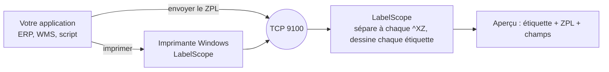

<p align="center">
  🌎 <a href="README.md">English</a> · <a href="README.es.md">Español</a> · <a href="README.pt-BR.md">Português</a> · <strong>Français</strong>
</p>

<p align="center">
  
</p>

<h1 align="center">LabelScope</h1>

<p align="center">
  <strong>Une imprimante d'étiquettes Zebra® virtuelle pour Windows.</strong><br>
  Envoyez du ZPL depuis n'importe quel programme. Voyez l'étiquette à l'écran, repérez les problèmes et économisez le papier.
</p>

<p align="center">
  <a href="https://github.com/P4Software/LabelScope/releases/latest"></a>
  <a href="LICENSE"></a>
  
  <a href="https://github.com/P4Software/LabelScope/releases"></a>
</p>

<p align="center">
  <a href="https://github.com/P4Software/LabelScope/releases/latest/download/LabelScope-Setup.exe"><strong>Télécharger LabelScope-Setup.exe</strong></a>
  &nbsp;·&nbsp;
  <a href="https://github.com/P4Software/LabelScope/releases/latest">Toutes les versions</a>
  <br>
  <sub>Version 0.4.1 · Windows 10 ou 11, 64 bits · gratuit · aucun droit d'administrateur requis pour l'installation</sub>
</p>

---

## Pourquoi LabelScope

**Voyez chaque étiquette avant qu'elle soit imprimée.**
Les systèmes d'entrepôt, d'expédition et de commerce de détail impriment des étiquettes en envoyant du texte ZPL à une imprimante Zebra. LabelScope se fait passer pour cette imprimante. Votre étiquette apparaît à l'écran en quelques secondes, à côté du ZPL qui l'a dessinée. Pas de rouleau d'étiquettes, pas de papier gaspillé.

**Repérez les problèmes avant qu'ils coûtent cher.**
Un code-barres qui dépasse le bord de l'étiquette ne sera pas lisible. LabelScope l'encadre en rouge et vous explique pourquoi, en mots simples. Chaque commande qu'il ne peut pas dessiner est listée avec son numéro de ligne, au lieu d'échouer en silence.

**Fonctionne hors ligne. Gratuit. Signé.**
Les étiquettes sont dessinées sur votre PC. Rien n'est téléversé, rien n'est facturé à l'usage. Le programme d'installation est signé numériquement, il est gratuit sous licence MIT et ne demande aucun droit d'administrateur.

---

## Ce que vous obtenez

### Cliquez sur un champ, trouvez sa ligne ZPL

L'onglet **Champs** liste tout ce que LabelScope a dessiné : textes, codes-barres, cadres, cercles, lignes et graphiques, chacun avec sa position, sa taille, sa police et sa ligne ZPL. Cliquez sur un champ de l'étiquette, une rangée de la liste ou une ligne de ZPL, et les trois sélectionnent le même élément.

<p align="center">
  
</p>

### Sachez quand un code-barres ne sera pas lisible

Quand un code-barres dépasse de l'étiquette, LabelScope l'entoure d'un contour rouge et dit, en mots simples, ce qui ne va pas, quoi faire et quelle ligne est en cause. La carte du travail à gauche devient rouge elle aussi, vous le voyez donc avant même d'ouvrir l'étiquette.

<p align="center">
  
</p>

### Configurez une fois, sur un seul écran

**Configurer l'imprimante** regroupe ce dont presque tout le monde a besoin : le nom de l'imprimante Windows avec un bouton **Réinstaller l'imprimante**, la taille de l'étiquette (neuf tailles courantes ou la vôtre en millimètres), la densité d'impression (203, 300 ou 600 ppp), la langue, l'affichage immédiat de chaque nouveau travail et la conservation des travaux à la fermeture de LabelScope.

<p align="center">
  
</p>

### En français, anglais, espagnol et portugais

Choisissez English, Español, Português (Brasil) ou Français dans la barre d'outils, ou laissez LabelScope suivre la langue de Windows. Tous les textes changent, y compris les avertissements et les messages qui expliquent ce qui n'a pas fonctionné et quoi faire ensuite. Les travaux déjà à l'écran sont redessinés dans la langue choisie.

<p align="center">
  
</p>

### Chaque travail d'impression, une carte

Chaque envoi de votre système devient une carte, la plus récente en premier, avec l'heure, l'expéditeur, le nombre d'étiquettes et « Dessinée correctement » ou le premier problème. Un travail de plusieurs étiquettes affiche *Étiquette 1 sur 3* avec des flèches pour les parcourir. Cochez **Conserver les travaux en quittant LabelScope** et votre liste sera encore là demain.

<p align="center">
  
</p>

### Et aussi

- **Étiquette et ZPL côte à côte**, avec les commandes en couleur et les numéros de ligne. L'onglet **Journal** note ce qui est arrivé à chaque travail.
- **Ouvrir un fichier ZPL** et **Coller le ZPL** pour vérifier une étiquette sans rien envoyer.
- **La taille de l'étiquette vient d'abord du ZPL.** `^PW` et `^LL` ont priorité; si l'étiquette n'en envoie pas, LabelScope utilise la taille envoyée par un travail précédent, puis l'étiquette chargée dans Configurer l'imprimante (aussi dans la liste des tailles de la barre d'outils).
- **Enregistrer en PNG** ou copier l'étiquette comme image. La taille de l'étiquette s'affiche en pouces et en points.
- **Mémoire d'imprimante** comme sur une vraie imprimante : les graphiques, polices et réglages envoyés dans un travail restent disponibles pour le suivant.
- **Mise à jour depuis l'application** et un **journal de plantage** (crash log) si quelque chose tourne mal.

---

## Démarrage rapide en 60 secondes

1. **[Téléchargez LabelScope-Setup.exe](https://github.com/P4Software/LabelScope/releases/latest/download/LabelScope-Setup.exe)** et lancez-le. Il s'installe pour votre utilisateur seulement.
2. Ouvrez **LabelScope** depuis le menu Démarrer.
3. Ouvrez **Configurer l'imprimante** et cliquez sur **Réinstaller l'imprimante**, ou utilisez le menu **...** et choisissez **Installer l'imprimante**. Répondez **Oui** quand Windows le demande. C'est la seule étape qui demande une autorisation d'administrateur.
4. Imprimez depuis n'importe quel programme vers l'imprimante nommée **LabelScope**, ou envoyez du ZPL à `127.0.0.1` port `9100`.
5. Le travail apparaît à gauche et l'étiquette au centre. Cliquez dessus, cliquez sur un champ, lisez le ZPL.

Pas de ZPL sous la main? Cliquez sur **Coller le ZPL** et collez ceci :

```zpl
^XA
^FX Shipping label
^PW812^LL406
^FO50,50^A0N,60,60^FDHello LabelScope^FS
^FO50,140^GB700,4,4^FS
^FO50,180^BY3^BCN,100,Y,N,N^FD12345678^FS
^XZ
```

Ou envoyez-le depuis PowerShell :

```powershell
$zpl = "^XA^FO50,50^A0N,60,60^FDHello LabelScope^FS^FO50,150^GB400,4,4^FS^XZ"
$client = New-Object Net.Sockets.TcpClient("127.0.0.1", 9100)
$bytes = [Text.Encoding]::UTF8.GetBytes($zpl)
$client.GetStream().Write($bytes, 0, $bytes.Length)
$client.Close()
```

Pour retirer l'imprimante plus tard, utilisez **Retirer l'imprimante** dans le menu **...**. LabelScope ne retire jamais qu'une imprimante qu'il a créée lui-même.

---

## Comment ça fonctionne



- L'imprimante Windows utilise le pilote **Generic / Text Only** fourni avec Windows; pour les travaux d'impression bruts (raw), le ZPL arrive donc intact à LabelScope.
- Les programmes qui savent parler TCP contournent l'imprimante et envoient directement au port **9100**, le port standard des imprimantes d'étiquettes en réseau.
- Le dessin se fait **dans LabelScope**. Il n'y a aucun service en ligne.

---

## ZPL pris en charge

LabelScope dessine ce qu'il comprend et **vous signale tout le reste**. Le but des prochaines versions est la prise en charge complète du ZPL.

| Groupe | Commandes |
|---|---|
| Étiquette et champs | `^XA ^XZ ^PW ^LL ^LH ^LR ^PO ^PQ ^FO ^FT ^FD ^FS ^FW ^FH ^FB ^FR ^FX ^CF` |
| Jeux de caractères | `^CI` : `^CI28` (UTF-8) et les autres jeux Unicode 29 et 30 sont dessinés comme une imprimante les imprime. `^CI0` à `^CI27` et 31 à 36 sont exacts pour le texte ASCII simple |
| Texte et polices | `^A` avec les polices `0`, `A` à `H` et `P` à `V`; `^A@` et `^CW` avec vos propres polices |
| Formes | `^GB ^GC ^GD` |
| Codes-barres | `^BY ^BC ^B3 ^BL ^BA ^BE ^BU ^B8 ^B9 ^B2 ^BK ^B1 ^BM ^BQ ^BX ^B7` : Code 128, Code 39, LOGMARS, Code 93, EAN-13, UPC-A, EAN-8, UPC-E, Interleaved 2 of 5, Codabar, Code 11, MSI, QR Code, Data Matrix, PDF417 |
| Graphiques | `^GF` (hexadécimal ASCII, compression Zebra, Z64, B64), `~DG ~DY ^XG ^IM ^IL ^IS ^ID ~DN` |

**Pas encore.** Ces commandes affichent un avertissement et sont ignorées; elles sont les premières sur la liste pour la prochaine version :

- Formats stockés et compteurs : `^DF` / `^XF`, `^SN`, `^FV`.
- Jeux de caractères : les lettres accentuées et autres lettres non ASCII des pages de codes à un octet (`^CI0` à `^CI27`, 31 à 36, comme CP850) sont encore en cours de finition. Une telle étiquette affiche un avertissement qui nomme le jeu.
- Codes-barres : `^BI ^BJ ^BP ^BS ^B5 ^BZ ^BR ^BD ^B0 ^BO ^B4 ^BB ^BT ^BF` (industrial 2 of 5, Plessey, compléments, codes postaux, GS1 DataBar, MaxiCode, Aztec, Code 49, CODABLOCK, TLC39, MicroPDF417).
- Graphiques : données binaires (`^GF` et `~DY` format B), la compression AR de Zebra (format C), les polices bitmap téléchargeables (`~DB`). `~EG` affiche un avertissement; utilisez `^ID`.

Quelques commandes qui changent le comportement de l'imprimante mais pas l'image (`^MN ^MM ^MD ^MT ^PR ^JU`) sont ignorées sans avertissement.

### Limites à connaître

- **Les polices sont approximatives par la forme, exactes par la taille.** Les polices propres à Zebra sont sous licence et ne peuvent pas être distribuées; LabelScope dessine donc les polices A à H avec les tailles de cellule de Zebra, et la police 0 et P à V avec Noto Sans ExtraCondensed Bold placée et dimensionnée comme la police 0 de Zebra. Les majuscules commencent sur la ligne du `^FO` et ont la même hauteur que sur une imprimante, et la longueur des lignes reste à environ 2 % près. La forme des lettres diffère. Les polices OCR E et H sont dessinées dans une police simple à chasse fixe. Les caractères qu'une police n'a pas s'impriment comme des espaces, avec un avertissement. LabelScope est un outil d'aperçu, pas un remplacement exact au pixel près d'une imprimante.
- **Les codes-barres et les graphiques sont dessinés selon les règles publiées et n'ont pas encore été comparés avec une vraie imprimante Zebra.** Ils sont décodés correctement par un décodeur indépendant, mais de petits détails peuvent différer : la zone blanche autour d'un symbole, la taille choisie pour le PDF417 quand l'étiquette ne donne ni colonnes ni rangées, ou la taille des chiffres sous un EAN/UPC. Pour le PDF417, la hauteur de rangée (`h`) est prise en points; une imprimante peut la multiplier par la largeur de module. Testez toujours la lecture d'une étiquette importante sur votre vraie imprimante.
- **La mémoire d'imprimante dure tant que LabelScope est ouvert.** Les graphiques et polices envoyés avec `~DG`, `~DY` ou `^IS`, et les lettres de police définies avec `^CW`, sont gardés, comme sur le lecteur R: d'une imprimante, jusqu'à ce que vous fermiez LabelScope ou cliquiez sur **Vider la mémoire de l'imprimante** (dans le menu **...**), jusqu'à 64 Mo ou 1000 objets. Une étiquette qui utilise un graphique que LabelScope n'a jamais reçu est dessinée sans lui, avec un avertissement qui nomme le fichier.
- **La taille de l'étiquette vient du ZPL.** La largeur est `^PW` et la longueur est `^LL`, de l'étiquette elle-même ou d'un travail précédent; les logiciels d'étiquettes les envoient souvent une seule fois dans un travail de configuration, et LabelScope les garde (avec `^LH`, `^PO` et `^LR`) comme le fait une imprimante. Quand le ZPL ne donne jamais de taille, LabelScope utilise l'étiquette chargée dans Configurer l'imprimante ou choisie dans la liste des tailles de la barre d'outils (4 x 6 po à 203 ppp au départ). La taille est limitée à 8000 points par côté et 40 millions de points au total, avec un avertissement.
- **`^BY`, `^FW` et `^CF` ne s'appliquent qu'à une seule étiquette.** Chaque étiquette commence avec les réglages d'imprimante initiaux; répétez donc la commande dans chaque étiquette qui en a besoin.
- **Données graphiques binaires et séparation des travaux.** LabelScope sépare un envoi à chaque `^XZ`, même à l'intérieur de données graphiques binaires. Pour l'instant, envoyez les graphiques en hexadécimal ASCII ou en Z64.
- **`^GF` est peint là où il est écrit.** Un `^FR` écrit après `^GF` dans le même champ ne l'inverse pas; placez `^FR` avant `^GF`.
- **La valeur de contrôle des graphiques Z64 et B64 n'est pas vérifiée.** Zebra ne publie pas la méthode. Les données Z64 sont tout de même vérifiées par la somme de contrôle de leur propre compression et par leur taille.
- **Détails des codes-barres.** Un Data Matrix de qualité 0 à 140 est dessiné avec le type moderne ECC 200, avec un avertissement. Les identifiants d'application GS1 en mode D du Code 128 ne sont pas validés. Les données QR avec des lettres accentuées sont envoyées en Latin-1 quand tous les caractères y entrent, alors qu'une imprimante réglée en UTF-8 envoie de l'UTF-8; les deux se lisent, mais les octets lus peuvent différer.
- **Encodage du texte.** Chaque étiquette est lue d'abord en UTF-8, puis en Windows-1252 si ce n'est pas de l'UTF-8 valide. Les étiquettes en `^CI28` dessinent exactement les lettres accentuées. Avec un jeu `^CI` à un octet, le texte ASCII simple est exact; les autres lettres peuvent différer de l'imprimante et l'étiquette le signale par un avertissement. Une étiquette qui annonce `^CI28` sans envoyer d'UTF-8 reçoit aussi un avertissement.
- **Vitesse.** Les étiquettes courantes apparaissent aussitôt, et un envoi de 5000 étiquettes est dessiné en environ 16 secondes. Une étiquette qui place des dizaines de graphiques pleine taille peut prendre plusieurs secondes. Un champ de texte de plus de 65536 caractères est coupé, avec un avertissement. Une seule étiquette de plus de 16 Mo sans `^XZ` est rejetée, avec un message.
- **Les coins arrondis de `^GB` sont dessinés droits**, avec un avertissement.

---

## Configurer l'imprimante et paramètres

Ouvrez **Configurer l'imprimante** dans la barre d'outils. Cliquez sur **Enregistrer** et le changement s'applique aussitôt; la taille, la densité et la langue redessinent les travaux déjà à l'écran.

| Option | Ce qu'elle fait |
|---|---|
| Nom de l'imprimante | Le nom de l'imprimante Windows. Au plus 60 caractères, sans `* ? [ ] \ / !`. Un nouveau nom s'applique quand vous cliquez sur **Réinstaller l'imprimante**. |
| Taille de l'étiquette | Neuf tailles courantes, ou **Personnalisée** en millimètres (5 à 2000). Utilisée seulement quand le ZPL ne donne pas de `^PW` / `^LL`. |
| Densité d'impression | 203, 300 ou 600 ppp. |
| Langue | Langue de Windows, anglais, espagnol, portugais (Brésil) ou français. |
| Afficher aussitôt chaque travail reçu | Activé par défaut. Désactivez-le pour continuer à regarder le travail sélectionné. |
| Conserver les travaux en quittant LabelScope | Désactivé par défaut. S'il est activé, vos travaux reviennent au prochain démarrage (stockés dans `%LocalAppData%\LabelScope`). |

LabelScope marque l'imprimante qu'il crée. Il ne modifie ni ne retire jamais une imprimante qu'il n'a pas créée, même si elle porte le même nom. L'imprimante renvoie vers `127.0.0.1` sur le port d'écoute; si vous changez le port, réinstallez donc l'imprimante.

### Avancé : settings.json

`settings.json` se trouve à côté du programme et est créé au premier démarrage avec une explication pour chaque option. Si une valeur est incorrecte, LabelScope revient à une valeur par défaut sûre et vous dit quel paramètre corriger. Le fichier peut contenir des commentaires `//`. Ne le modifiez que pour les clés ci-dessous, puis redémarrez LabelScope.

| Paramètre | Par défaut | Signification |
|---|---|---|
| `ListenAddress` | `127.0.0.1` | `127.0.0.1` accepte les étiquettes de cet ordinateur seulement; `0.0.0.0` les accepte aussi depuis le réseau. Aucune autre valeur n'est acceptée. |
| `ListenPort` | `9100` | Port du ZPL entrant, de 1 à 65535. Changez-le si un autre programme utilise déjà le 9100. |
| `HistoryLimit` | `100` | Nombre de travaux gardés dans la liste, de 1 à 1000. |
| `FontsFolder` | vide | Dossier contenant vos propres polices TrueType (`.ttf`) ou OpenType (`.otf`). Une étiquette qui nomme un fichier de police avec `^A@` ou `^CW` (par exemple `E:ARIAL.TTF`) utilise le fichier du même nom dans ce dossier. |
| `LogFolder` | `logs` | Où les fichiers journaux sont écrits. Un dossier relatif l'est par rapport au dossier du programme. |
| `CheckForUpdates` | `true` | Demande une fois à GitHub, au démarrage, s'il existe une version plus récente. LabelScope ne fait que vous le dire; il installe une nouvelle version quand vous cliquez sur **Mettre à jour**. |
| `ShowGrid` / `StackedLayout` | `false` | Démarrer avec une grille légère de 10 mm sur l'étiquette, ou avec le ZPL sous l'image. Aussi dans le menu **...**. |

Gardez LabelScope dans un dossier où vous pouvez écrire, comme celui qu'utilise le programme d'installation, et pas dans `Program Files` si vous lancez une version copiée : il écrit `settings.json` et son dossier `logs` à côté de lui. L'écoute sur `0.0.0.0` peut faire apparaître une demande du pare-feu Windows, et y répondre demande un administrateur.

---

## FAQ et dépannage

| Problème | Que faire |
|---|---|
| « Le port 9100 est déjà utilisé par un autre programme » | Un autre programme (ou un deuxième LabelScope) utilise le port. Fermez-le, ou indiquez un autre `ListenPort` dans `settings.json`, redémarrez LabelScope et réinstallez l'imprimante. La ligne d'état affiche le problème en rouge tant qu'il n'est pas réglé. |
| « LabelScope n'a pas pu commencer l'écoute sur ... » | Vérifiez `ListenAddress` et `ListenPort` dans `settings.json`. |
| « Windows a demandé une autorisation et elle n'a pas été accordée; rien n'a donc été changé » | La demande a été refusée. Réessayez et choisissez **Oui**. |
| « Une imprimante nommée ... existe déjà et n'a pas été créée par LabelScope » | LabelScope ne touche pas aux imprimantes qu'il n'a pas créées. Choisissez un autre nom dans **Configurer l'imprimante**. |
| « L'imprimante n'a pas pu être installée : ... » ou « n'a pas pu vérifier quelles imprimantes sont installées » | Vérifiez que le service Windows « Spouleur d'impression » est en cours d'exécution, puis réessayez. Si l'échec se répète, montrez le message à votre administrateur. Les détails se trouvent dans le journal. |
| Un travail intitulé « Aucune étiquette trouvée » | Les données reçues ne contenaient pas de bloc `^XA ... ^XZ` (par exemple une demande d'état, ou un document ordinaire imprimé vers l'imprimante LabelScope). Le texte est affiché dans l'onglet ZPL. |
| Un travail intitulé « Étiquette non dessinée » | Les données contenaient un début d'étiquette (`^XA`), mais rien n'a pu en être dessiné. Consultez l'onglet **Journal**. |
| Un code-barres a un contour rouge | Il dépasse de l'étiquette ou est trop large pour son espace; il ne sera donc pas lisible. Déplacez-le, raccourcissez les données ou utilisez une largeur de module plus petite dans `^BY`. |
| « LabelScope est occupé : trop de programmes envoient des étiquettes en même temps » | Plus de 16 programmes étaient connectés en même temps. Attendez un instant et envoyez de nouveau. |
| « Le fichier de paramètres n'a pas pu être lu ... » | Il y a une faute de frappe dans `settings.json`. Corrigez-la, ou supprimez le fichier pour en obtenir un nouveau, puis redémarrez. Les paramètres standard sont utilisés entre-temps. |
| « Une étiquette de plus de 16 Mo a été reçue sans marque de fin (^XZ) et a été rejetée » | L'expéditeur n'envoie pas de vraies étiquettes, ou n'envoie jamais `^XZ`. Vérifiez le programme qui envoie les étiquettes. |
| « Une étiquette est arrivée incomplète (pas de ^XZ à la fin) » | L'expéditeur s'est déconnecté avant d'envoyer `^XZ`. L'étiquette est affichée jusqu'où elle est arrivée. |
| Une étiquette n'a pas la même allure que sur la vraie imprimante | Les polices sont approximatives par la forme et certaines commandes ne sont pas encore prises en charge. Consultez l'onglet **Journal**. |
| LabelScope s'est fermé tout seul, ou a affiché « LabelScope hit an unexpected error » | Les détails techniques se trouvent dans `crash.log`, dans le dossier `logs` à côté du programme, ou dans `%LocalAppData%\LabelScope\logs` si ce dossier est en lecture seule. Le fichier peut contenir des chemins de fichiers, y compris votre nom d'utilisateur Windows; relisez-le donc avant de l'envoyer par courriel. |
| Autre chose | Ouvrez le menu **...**, choisissez **Ouvrir le dossier des journaux** et regardez le fichier le plus récent. |

---

## Confidentialité et sécurité

- Les étiquettes sont dessinées localement et ne quittent jamais votre ordinateur. La seule requête Internet de LabelScope est une petite question à GitHub au démarrage (« y a-t-il une version plus récente? »). Il n'envoie rien sur vous ni sur vos étiquettes. Mettez `CheckForUpdates` à `false` pour désactiver même cela.
- Par défaut, LabelScope n'écoute que sur `127.0.0.1`; les autres ordinateurs ne peuvent donc pas le joindre. Ne mettez `ListenAddress` à `0.0.0.0` que sur des réseaux de confiance : quiconque peut joindre le port peut lui envoyer des étiquettes.
- Le programme ne s'exécute jamais en tant qu'administrateur. Seules l'installation et la suppression de l'imprimante demandent une autorisation à Windows.
- LabelScope ne modifie ni ne retire jamais une imprimante qu'il n'a pas créée.
- Le programme d'installation est signé numériquement. La signature de l'éditeur d'une mise à jour téléchargée est vérifiée avant son lancement.
- Si vous activez **Conserver les travaux en quittant**, le ZPL de vos travaux est enregistré dans un fichier sur votre PC. Désactivez l'option si les étiquettes contiennent des données que vous ne voulez pas garder.

---

## Compiler à partir du code source

Il vous faut Windows 10 ou 11 et le [SDK .NET 10](https://dotnet.microsoft.com/download/dotnet/10.0) ou plus récent.

```powershell
git clone https://github.com/P4Software/LabelScope.git
cd LabelScope
dotnet build
dotnet run --project src/LabelScope.App
```

Si la restauration des paquets échoue à cause d'une source NuGet défectueuse ou injoignable, ajoutez la source publique :

```powershell
dotnet build -p:RestoreSources=https://api.nuget.org/v3/index.json
```

Version autonome (rien à installer sur l'ordinateur cible) :

```powershell
dotnet publish src/LabelScope.App -c Release -r win-x64 --self-contained -o publish/win-x64
```

Copiez `publish/win-x64` sur n'importe quel PC Windows 10 ou 11 et double-cliquez sur `LabelScope.exe`.

```
src/LabelScope.Core/    Paramètres, écoute TCP, analyse et dessin du ZPL, installation de l'imprimante (sans interface)
src/LabelScope.App/     L'application Windows (WPF)
installer/              Script Inno Setup et la compilation qui crée et signe le programme d'installation
assets/                 Logo, icône et captures d'écran
```

---

## Feuille de route

- [x] **0.2.0** Codes-barres et texte pivoté
- [x] **0.3.0** Graphiques, images et polices personnalisées; programme d'installation signé
- [x] **0.4.0** Nouvelle fenêtre, onglet Champs, avertissement rouge pour les codes-barres illisibles, interface complète en espagnol, Configurer l'imprimante, conservation des travaux
- [x] **0.4.1** Portugais (Brésil) et français
- [ ] **0.5** ZPL complet : les pages de codes `^CI` restantes, `^DF` / `^XF`, `^SN`, `^FV`, les codes-barres restants, les graphiques binaires
- [ ] Comparaison des codes-barres et des graphiques avec une vraie imprimante Zebra
- [ ] En option : enregistrer automatiquement chaque étiquette reçue en fichier PDF ou image

---

## Contribuer

Les rapports de bogues et les demandes de fonctionnalités sont les bienvenus dans [Issues](https://github.com/P4Software/LabelScope/issues). Le rapport le plus utile contient le ZPL mal dessiné (retirez d'abord toute donnée privée) et, si possible, une photo de ce qu'imprime votre imprimante.

---

## Licence et remerciements

LabelScope est un logiciel libre de [P4 Software](https://github.com/P4Software) sous [licence MIT](LICENSE) : vous pouvez l'utiliser, le copier, le modifier et le partager, y compris dans un cadre commercial, à condition que l'avis de droit d'auteur et le texte de la licence l'accompagnent.

Il utilise SkiaSharp, Serilog, ZXing.Net et le runtime .NET, et mentionne la bibliothèque de génération de codes QR de Project Nayuki. Les polices intégrées de Zebra sont dessinées avec les polices incluses Noto Sans ExtraCondensed Bold et IBM Plex Mono (SIL Open Font License 1.1). Toutes les licences et tous les avis de droit d'auteur se trouvent dans [THIRD-PARTY-NOTICES.txt](THIRD-PARTY-NOTICES.txt), qui est aussi installé à côté de `LabelScope.exe`.

Zebra® et ZPL® sont des marques de commerce de Zebra Technologies Corporation. LabelScope est un produit indépendant; il n'est ni affilié à Zebra Technologies ni approuvé par elle.
