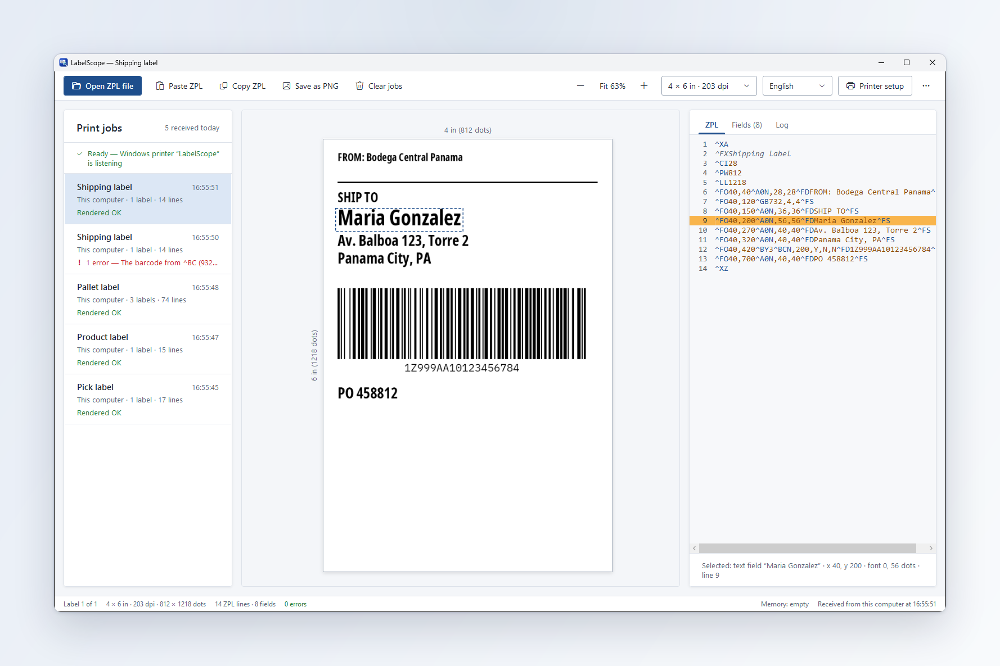
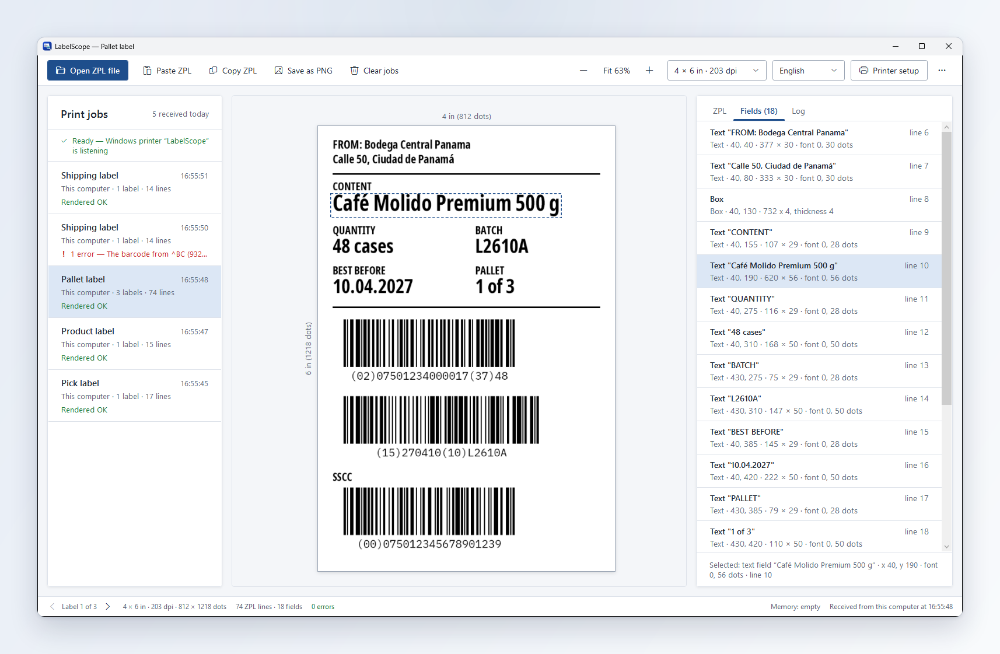
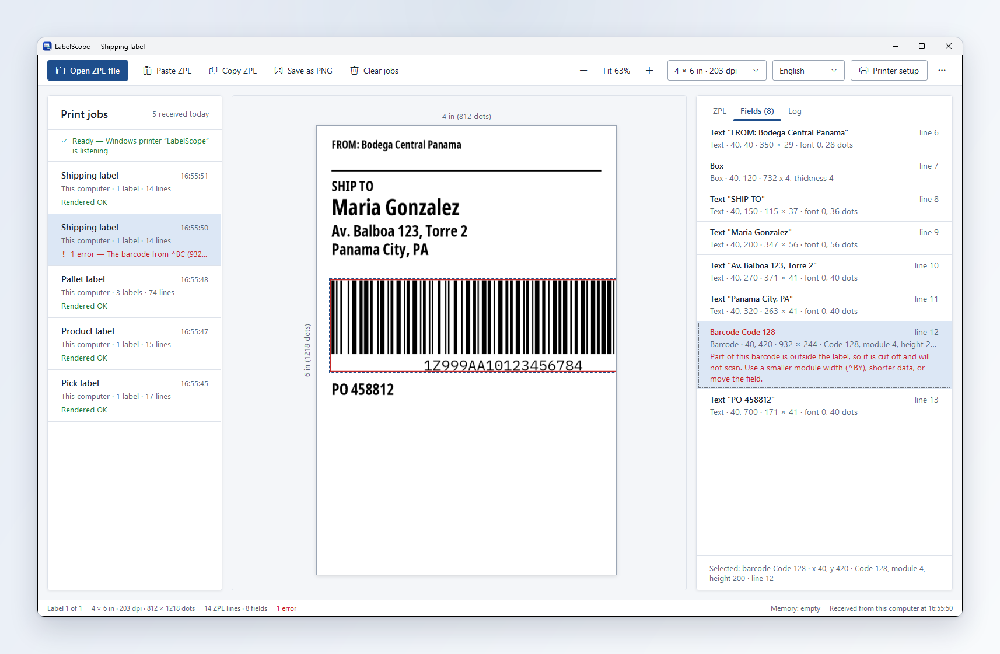
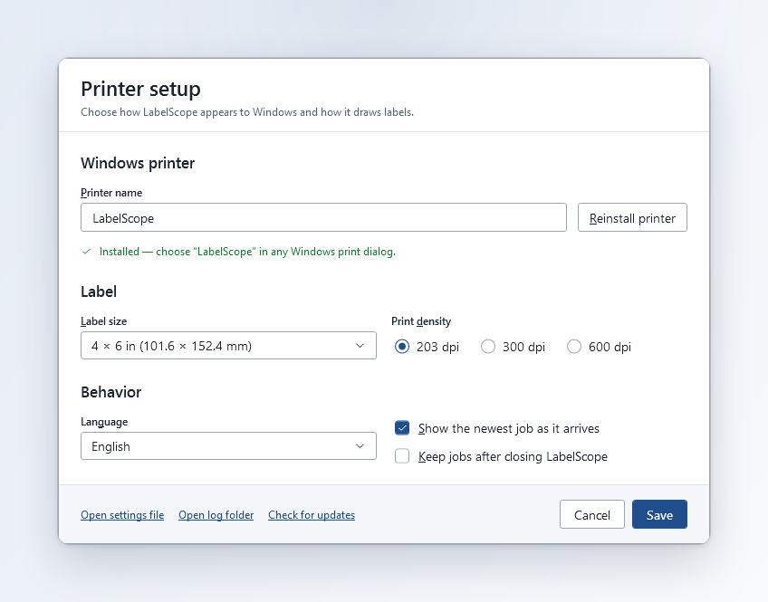
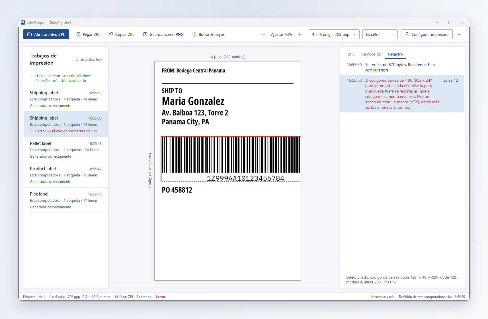
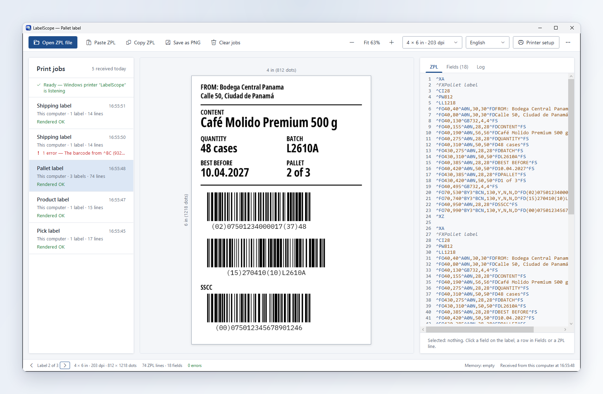
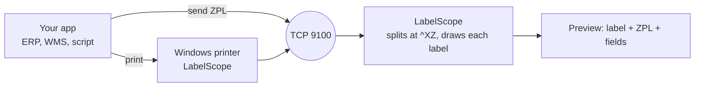

<p align="center">
  🌎 <strong>English</strong> · <a href="README.es.md">Español</a> · <a href="README.pt-BR.md">Português</a> · <a href="README.fr.md">Français</a>
</p>

<p align="center">
  
</p>

<h1 align="center">LabelScope</h1>

<p align="center">
  <strong>A virtual Zebra® label printer for Windows.</strong><br>
  Send ZPL from any program. See the label on screen, find the problems, and save the paper.
</p>

<p align="center">
  <a href="https://github.com/P4Software/LabelScope/releases/latest"></a>
  <a href="LICENSE"></a>
  
  <a href="https://github.com/P4Software/LabelScope/releases"></a>
</p>

<p align="center">
  <a href="https://github.com/P4Software/LabelScope/releases/latest/download/LabelScope-Setup.exe"><strong>Download LabelScope-Setup.exe</strong></a>
  &nbsp;·&nbsp;
  <a href="https://github.com/P4Software/LabelScope/releases/latest">All releases</a>
  <br>
  <sub>Version 0.4.1 · Windows 10 or 11, 64-bit · free · no administrator rights needed to install</sub>
</p>

---

## En español · Em português · En français

**Español.** LabelScope es una impresora Zebra® virtual para Windows: recibe el ZPL que envía su sistema (ERP, WMS, envíos) y muestra la etiqueta en pantalla, sin impresora física ni papel. Toda la interfaz está en español. **[Lea el README completo en español](README.es.md)**.

**Português.** O LabelScope é uma impressora Zebra® virtual para Windows: recebe o ZPL que o seu sistema (ERP, WMS, expedição) envia e mostra a etiqueta na tela, sem impressora física nem papel. Desde a versão 0.4.1 toda a interface está em português do Brasil. **[Leia o README completo em português](README.pt-BR.md)**.

**Français.** LabelScope est une imprimante Zebra® virtuelle pour Windows : il reçoit le ZPL que votre système (ERP, WMS, expédition) envoie et affiche l'étiquette à l'écran, sans imprimante physique ni papier. Depuis la version 0.4.1, toute l'interface est en français. **[Lisez le README complet en français](README.fr.md)**.

---

## Why LabelScope

**See every label before it prints.**
Warehouse, shipping and retail systems print labels by sending ZPL text to a Zebra printer. LabelScope pretends to be that printer. Your label appears on screen in seconds, next to the ZPL that drew it. No roll of labels, no wasted paper.

**Catch problems before they cost you.**
A barcode that runs off the edge of the label will not scan. LabelScope outlines it in red and tells you why, in plain words. Every command it cannot draw is listed with its line number instead of failing silently.

**Works offline. Free. Signed.**
Labels are drawn on your PC. Nothing is uploaded, nothing is metered. The installer is digitally signed, it is free under the MIT licence, and it needs no administrator rights.

---

## What you get

### Click a field, find its ZPL line

The **Fields** tab lists everything LabelScope drew: text, barcodes, boxes, circles, lines and graphics, each with its position, size, font and ZPL line. Click a field on the label, a row in the list, or a line of ZPL, and all three select the same thing.

<p align="center">
  
</p>

### Know when a barcode will not scan

When a barcode runs off the label, LabelScope draws a red outline around it and says, in plain words, what is wrong, what to do and which line is responsible. The job card on the left turns red too, so you see it before you open the label.

<p align="center">
  
</p>

### Set it up once, in one screen

**Printer setup** holds what most people ever need: the Windows printer name with a **Reinstall printer** button, the label size (nine common sizes or your own in millimetres), print density (203, 300 or 600 dpi), the language, whether the newest job is shown as it arrives, and whether jobs are kept after you close LabelScope.

<p align="center">
  
</p>

### In English, Spanish, Portuguese and French

Choose English, Español, Português (Brasil) or Français from the toolbar, or let LabelScope follow the Windows language. Every text changes, including the warnings and the messages about what went wrong and what to do next. Jobs already on screen are drawn again in the new language.

<p align="center">
  
</p>

### Every print job, one card

Each send from your system becomes one card, newest first, with the time, the sender, the number of labels and either "Rendered OK" or the first problem. A job with several labels shows *Label 1 of 3* with arrows to page through them. Turn on **Keep jobs after closing LabelScope** and your list is still there tomorrow.

<p align="center">
  
</p>

### And also

- **Label and ZPL side by side**, with coloured commands and line numbers. The **Log** tab records what happened to each job.
- **Open ZPL file** and **Paste ZPL** to check a label without sending anything.
- **Label size from the ZPL first.** `^PW` and `^LL` win; if the label sends none, LabelScope uses the size an earlier job sent, then the label loaded in Printer setup (also in the size list in the toolbar).
- **Save as PNG** or copy the label as an image. The label size shows in inches and dots.
- **Printer memory** like a real printer: graphics, fonts and settings sent in one job are available to the next.
- **Update inside the app** and a **crash log** if something goes wrong.

---

## Quick start in 60 seconds

1. **[Download LabelScope-Setup.exe](https://github.com/P4Software/LabelScope/releases/latest/download/LabelScope-Setup.exe)** and run it. It installs for your user only.
2. Open **LabelScope** from the Start menu.
3. Open **Printer setup** and press **Reinstall printer**, or use the **...** menu and choose **Install printer**. Answer **Yes** when Windows asks. This is the only step that needs administrator permission.
4. Print from any program to the printer called **LabelScope**, or send ZPL to `127.0.0.1` port `9100`.
5. The job appears on the left and the label in the middle. Click it, click a field, read the ZPL.

No ZPL at hand? Press **Paste ZPL** and paste this:

```zpl
^XA
^FX Shipping label
^PW812^LL406
^FO50,50^A0N,60,60^FDHello LabelScope^FS
^FO50,140^GB700,4,4^FS
^FO50,180^BY3^BCN,100,Y,N,N^FD12345678^FS
^XZ
```

Or send it from PowerShell:

```powershell
$zpl = "^XA^FO50,50^A0N,60,60^FDHello LabelScope^FS^FO50,150^GB400,4,4^FS^XZ"
$client = New-Object Net.Sockets.TcpClient("127.0.0.1", 9100)
$bytes = [Text.Encoding]::UTF8.GetBytes($zpl)
$client.GetStream().Write($bytes, 0, $bytes.Length)
$client.Close()
```

To remove the printer later, use **Remove printer** in the **...** menu. LabelScope only ever removes a printer it created itself.

---

## How it works



- The Windows printer uses the **Generic / Text Only** driver that ships with Windows, so for raw print jobs the ZPL reaches LabelScope untouched.
- Programs that can talk TCP skip the printer and send straight to port **9100**, the standard port for network label printers.
- Drawing happens **inside LabelScope**. There is no online service.

---

## Supported ZPL

LabelScope draws what it understands and **tells you about everything else**. The goal of the next releases is full ZPL support.

| Group | Commands |
|---|---|
| Label and fields | `^XA ^XZ ^PW ^LL ^LH ^LR ^PO ^PQ ^FO ^FT ^FD ^FS ^FW ^FH ^FB ^FR ^FX ^CF` |
| Character sets | `^CI`: `^CI28` (UTF-8) and the other Unicode sets 29 and 30 are drawn as a printer prints them. `^CI0` to `^CI27` and 31 to 36 are exact for plain ASCII text |
| Text and fonts | `^A` with fonts `0`, `A` to `H` and `P` to `V`; `^A@` and `^CW` with your own fonts |
| Shapes | `^GB ^GC ^GD` |
| Barcodes | `^BY ^BC ^B3 ^BL ^BA ^BE ^BU ^B8 ^B9 ^B2 ^BK ^B1 ^BM ^BQ ^BX ^B7`: Code 128, Code 39, LOGMARS, Code 93, EAN-13, UPC-A, EAN-8, UPC-E, Interleaved 2 of 5, Codabar, Code 11, MSI, QR Code, Data Matrix, PDF417 |
| Graphics | `^GF` (ASCII hex, Zebra compression, Z64, B64), `~DG ~DY ^XG ^IM ^IL ^IS ^ID ~DN` |

**Not yet.** These show a warning and are skipped, and they are first in line for the next release:

- Stored formats and counters: `^DF` / `^XF`, `^SN`, `^FV`.
- Character sets: accented and other non-ASCII letters in the byte-based code pages (`^CI0` to `^CI27`, 31 to 36, such as CP850) are still being completed. Such a label shows one warning naming the set.
- Barcodes: `^BI ^BJ ^BP ^BS ^B5 ^BZ ^BR ^BD ^B0 ^BO ^B4 ^BB ^BT ^BF` (industrial 2 of 5, Plessey, add-ons, postal codes, GS1 DataBar, MaxiCode, Aztec, Code 49, CODABLOCK, TLC39, MicroPDF417).
- Graphics: binary data (`^GF` and `~DY` format B), Zebra's AR compression (format C), downloadable bitmap fonts (`~DB`). `~EG` shows a warning; use `^ID`.

A few commands that change printer behaviour but not the picture (`^MN ^MM ^MD ^MT ^PR ^JU`) are ignored without a warning.

### Limits worth knowing

- **Fonts are approximate in shape, exact in size.** Zebra's own fonts are licensed and cannot be shipped, so LabelScope draws fonts A to H with Zebra's cell sizes, and font 0 and P to V with Noto Sans ExtraCondensed Bold placed and sized like Zebra's font 0. Capitals start on the `^FO` line and are as tall as on a printer, and line lengths land within about 2%. The letter shapes differ. The OCR fonts E and H are drawn in a plain fixed-width font. Characters a font does not have print as spaces, with a warning. LabelScope is a preview tool, not a pixel-exact replacement for a printer.
- **Barcodes and graphics are drawn from the published rules and have not yet been compared with a real Zebra printer.** They decode correctly with an independent decoder, but small details may differ: the quiet space around a symbol, the size picked for PDF417 when a label gives no columns and rows, or the digit size under EAN/UPC. For PDF417 the row height (`h`) is taken in dots; a printer may multiply it by the module width. Always scan-test an important label on your real printer.
- **Printer memory lasts while LabelScope runs.** Graphics and fonts sent with `~DG`, `~DY` or `^IS`, and font letters set with `^CW`, are kept, like a printer's R: drive, until you close LabelScope or press **Clear printer memory** (in the **...** menu), up to 64 MB or 1000 objects. A label that uses a graphic LabelScope never received is drawn without it, with a warning naming the file.
- **Label size comes from the ZPL.** Width is `^PW` and length is `^LL`, from the label itself or from an earlier job; label programs often send them once in a setup job, and LabelScope keeps them (with `^LH`, `^PO` and `^LR`) as a printer does. When the ZPL never gives a size, LabelScope uses the label loaded in Printer setup or chosen in the toolbar size list (4 x 6 in at 203 dpi to start with). Size is capped at 8000 dots per side and 40 million dots in total, with a warning.
- **`^BY`, `^FW` and `^CF` apply to one label only.** Every label starts with fresh printer settings, so repeat the command in each label that needs it.
- **Binary graphic data and job splitting.** LabelScope splits a send at every `^XZ`, even inside binary graphic data. Send graphics as ASCII hex or Z64 for now.
- **`^GF` is painted where it is written.** A `^FR` written after `^GF` in the same field does not invert it; put `^FR` before `^GF`.
- **The check value of Z64 and B64 graphics is not verified.** Zebra does not publish the method. Z64 data is still checked by its own compression checksum and its size.
- **Barcode details.** Data Matrix with quality 0 to 140 is drawn as the modern ECC 200 type, with a warning. GS1 application identifiers in Code 128 mode D are not validated. QR data with accented letters is sent as Latin-1 when every character fits, where a printer set to UTF-8 sends UTF-8; both scan, but the scanned bytes can differ.
- **Text encoding.** Each label is read as UTF-8 first, then as Windows-1252 if it is not valid UTF-8. Labels with `^CI28` draw accented letters exactly. With a byte-based `^CI` set, plain ASCII text is exact; other letters may differ from the printer and the label says so with one warning. A label that announces `^CI28` but does not send UTF-8 gets a warning too.
- **Speed.** Everyday labels appear at once, and one send of 5000 labels is drawn in about 16 seconds. A label that places dozens of full-size graphics can take several seconds. A text field longer than 65536 characters is cut, with a warning. A single label larger than 16 MB without `^XZ` is discarded, with a message.
- **Rounded corners on `^GB` are drawn square**, with a warning.

---

## Printer setup and settings

Open **Printer setup** in the toolbar. Press **Save** and the change applies at once; size, density and language re-draw the jobs already on screen.

| Option | What it does |
|---|---|
| Printer name | The name of the Windows printer. At most 60 characters, without `* ? [ ] \ / !`. A new name takes effect when you press **Reinstall printer**. |
| Label size | Nine common sizes, or **Custom** in millimetres (5 to 2000). Used only when the ZPL gives no `^PW` / `^LL`. |
| Print density | 203, 300 or 600 dpi. |
| Language | Windows language, English, Spanish, Portuguese (Brazil) or French. |
| Show the newest job as it arrives | On by default. Turn off to keep looking at the job you selected. |
| Keep jobs after closing LabelScope | Off by default. When on, your jobs come back at the next start (stored in `%LocalAppData%\LabelScope`). |

LabelScope marks the printer it creates. It never changes or removes a printer it did not create, even if the name is the same. The printer forwards to `127.0.0.1` on the listening port, so if you change the port, reinstall the printer.

### Advanced: settings.json

`settings.json` sits next to the program and is created on first start with an explanation for every option. If a value is wrong, LabelScope falls back to a safe default and tells you which setting to fix. The file may contain `//` comments. Edit it only for the keys below, then restart LabelScope.

| Setting | Default | Meaning |
|---|---|---|
| `ListenAddress` | `127.0.0.1` | `127.0.0.1` accepts labels from this computer only; `0.0.0.0` also accepts them from the network. No other value is accepted. |
| `ListenPort` | `9100` | Port for incoming ZPL, 1 to 65535. Change it if another program already uses 9100. |
| `HistoryLimit` | `100` | How many jobs to keep in the list, 1 to 1000. |
| `FontsFolder` | empty | Folder with your own TrueType (`.ttf`) or OpenType (`.otf`) fonts. A label that names a font file with `^A@` or `^CW` (for example `E:ARIAL.TTF`) uses the file with the same name from this folder. |
| `LogFolder` | `logs` | Where log files are written. A relative folder is relative to the program folder. |
| `CheckForUpdates` | `true` | Ask GitHub once at start whether a newer version exists. LabelScope only tells you; it installs a new version when you press **Update**. |
| `ShowGrid` / `StackedLayout` | `false` | Start with a light 10 mm grid over the label, or with the ZPL below the picture. Also in the **...** menu. |

Keep LabelScope in a folder you can write to, such as the one the installer uses, and not in `Program Files` if you run a copied build: it writes `settings.json` and its `logs` folder next to itself. Listening on `0.0.0.0` can make Windows show a firewall prompt, and answering it needs an administrator.

---

## FAQ and troubleshooting

| Problem | What to do |
|---|---|
| "Port 9100 is already in use by another program" | Another program (or a second LabelScope) uses the port. Close it, or set another `ListenPort` in `settings.json`, start LabelScope again, and reinstall the printer. The status line shows the problem in red until it is fixed. |
| "LabelScope could not start listening on ..." | Check `ListenAddress` and `ListenPort` in `settings.json`. |
| "Windows asked for permission and it was not given, so nothing was changed" | The prompt was declined. Try again and choose **Yes**. |
| "A printer named ... already exists and was not created by LabelScope" | LabelScope will not touch printers it did not create. Choose a different name in **Printer setup**. |
| "The printer could not be installed: ..." or "could not check which printers are installed" | Check that the Windows "Print Spooler" service is running, then try again. If it keeps failing, show the message to your administrator. Details are in the log. |
| A job titled "No label found" | The data that arrived had no `^XA ... ^XZ` block (for example a status request, or a normal document printed to the LabelScope printer). The text is shown in the ZPL tab. |
| A job titled "Label not drawn" | The data had a label start (`^XA`) but nothing could be drawn from it. Check the **Log** tab. |
| A barcode has a red outline | It runs off the label or is too wide for its space, so it will not scan. Move it, shorten the data, or use a narrower module width in `^BY`. |
| "LabelScope is busy: too many programs are sending labels at once" | More than 16 programs were connected at the same time. Wait a moment and send again. |
| "The settings file could not be read ..." | There is a typo in `settings.json`. Fix it, or delete the file to get a fresh one, then restart. Standard settings are used meanwhile. |
| "A label larger than 16 MB was received without an end marker (^XZ) and was discarded" | The sender is not sending real labels, or never sends `^XZ`. Check the program that sends the labels. |
| "A label arrived incomplete (no ^XZ at the end)" | The sender disconnected before sending `^XZ`. The label is shown as far as it arrived. |
| A label looks different from the real printer | Fonts are approximated in shape and some commands are not supported yet. Check the **Log** tab. |
| LabelScope closed by itself, or showed "LabelScope hit an unexpected error" | The technical details are in `crash.log` in the `logs` folder next to the program, or under `%LocalAppData%\LabelScope\logs` if that folder is read-only. The file can contain file paths, including your Windows user name, so look at it before you email it. |
| Something else | Open the **...** menu, choose **Open log folder**, and look at the newest file. |

---

## Privacy and security

- Labels are drawn locally and never leave your computer. The only internet request LabelScope makes is one small question to GitHub at start-up ("is there a newer version?"). It sends nothing about you or your labels. Set `CheckForUpdates` to `false` to switch even that off.
- By default LabelScope listens on `127.0.0.1` only, so other computers cannot reach it. Set `ListenAddress` to `0.0.0.0` only on networks you trust: anyone who can reach the port can send it labels.
- The program never runs as administrator. Only installing or removing the printer asks Windows for permission.
- LabelScope never changes or removes a printer it did not create.
- The installer is digitally signed. An update download is checked for the publisher's signature before it runs.
- If you turn on **Keep jobs after closing**, the ZPL of your jobs is saved in a file on your PC. Turn it off if labels contain data you do not want stored.

---

## Build from source

You need Windows 10 or 11 and the [.NET 10 SDK](https://dotnet.microsoft.com/download/dotnet/10.0) or a newer one.

```powershell
git clone https://github.com/P4Software/LabelScope.git
cd LabelScope
dotnet build
dotnet run --project src/LabelScope.App
```

If package restore fails because of a broken or unreachable NuGet source, add the public source:

```powershell
dotnet build -p:RestoreSources=https://api.nuget.org/v3/index.json
```

Self-contained build (nothing to install on the target computer):

```powershell
dotnet publish src/LabelScope.App -c Release -r win-x64 --self-contained -o publish/win-x64
```

Copy `publish/win-x64` to any Windows 10 or 11 PC and double-click `LabelScope.exe`.

```
src/LabelScope.Core/    Settings, TCP listener, ZPL parser and renderer, printer installer (no UI)
src/LabelScope.App/     The Windows (WPF) application
installer/              Inno Setup script and the build that creates and signs the installer
assets/                 Logo, icon and screenshots
```

---

## Roadmap

- [x] **0.2.0** Barcodes and rotated text
- [x] **0.3.0** Graphics, images and custom fonts; signed installer
- [x] **0.4.0** New window, Fields tab, red warning for barcodes that will not scan, full Spanish interface, Printer setup, keep jobs
- [x] **0.4.1** Portuguese (Brazil) and French
- [ ] **0.5** Complete ZPL: the remaining `^CI` code pages, `^DF` / `^XF`, `^SN`, `^FV`, the remaining barcodes, binary graphics
- [ ] Comparison of barcodes and graphics with a real Zebra printer
- [ ] Optional: save every received label automatically to PDF or image files

---

## Contributing

Bug reports and feature requests are welcome in [Issues](https://github.com/P4Software/LabelScope/issues). The most useful report includes the ZPL that draws wrongly (remove any private data first) and, if you can, a photo of what your printer prints.

---

## Licence and credits

LabelScope is free software by [P4 Software](https://github.com/P4Software) under the [MIT licence](LICENSE): you may use, copy, change and share it, including in commercial work, as long as the copyright notice and licence text stay with it.

It uses SkiaSharp, Serilog, ZXing.Net, AvalonEdit and the .NET runtime, and credits the Project Nayuki QR Code generator library. The built-in Zebra fonts are drawn with the bundled Noto Sans ExtraCondensed Bold and IBM Plex Mono fonts (SIL Open Font License 1.1). All licences and copyright notices are in [THIRD-PARTY-NOTICES.txt](THIRD-PARTY-NOTICES.txt), which is also installed next to `LabelScope.exe`.

Zebra® and ZPL® are trademarks of Zebra Technologies Corporation. LabelScope is an independent product and is not affiliated with or endorsed by Zebra Technologies.
