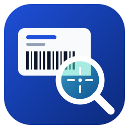

<p align="center">
  
</p>

<h1 align="center">LabelScope</h1>

<p align="center">
  A virtual Zebra® label printer for Windows.<br>
  Send ZPL to it from any program and see the label on screen, with no physical printer and no internet connection.
</p>

<p align="center">
  <em>By <a href="https://github.com/P4Software">P4 Software</a> · Status: in development. The first release is built and is being tested on real PCs. There is no download yet; <a href="#building-from-source">build and run it from source</a>.</em>
</p>

---

## Contents

- [What is LabelScope?](#what-is-labelscope)
- [Who is it for?](#who-is-it-for)
- [How it works](#how-it-works)
- [Features](#features)
- [Using it](#using-it)
- [Settings](#settings)
- [ZPL command support](#zpl-command-support)
- [Privacy and security](#privacy-and-security)
- [Building from source](#building-from-source)
- [Project layout](#project-layout)
- [Roadmap](#roadmap)
- [Troubleshooting](#troubleshooting)
- [Trademarks and licence](#trademarks-and-licence)

## What is LabelScope?

Warehouse, shipping and retail systems print labels by sending **ZPL** (Zebra Programming Language) text to a label printer. Testing that output normally needs a real printer, a roll of labels and a lot of wasted paper.

LabelScope pretends to be that printer. It installs a normal Windows printer, receives the ZPL, draws the label on screen and shows you the raw ZPL next to it, so you can check a label in seconds.

## Who is it for?

- **Developers and integrators** building or changing label output in an ERP, WMS or shipping system.
- **Support and implementation teams** who need to see exactly what a system sent to the printer.
- **Anyone** who wants to preview a ZPL file without owning a Zebra printer.

## How it works

```
 Any Windows program ──print──▶  "P4 LabelScope Printer"  ──┐
                                 (a real Windows printer)    │  TCP, port 9100
 ERP / WMS / script ──────────── send ZPL over the network ──┤
                                                             ▼
                                                      LabelScope
                                          ┌────────────────┴────────────────┐
                                          │  receives ZPL, splits it into   │
                                          │  labels at ^XZ, draws each one  │
                                          └────────────────┬────────────────┘
                                                           ▼
                                      ┌───────────────────────────────────────┐
                                      │  label picture   │   raw ZPL text      │
                                      │  (zoom, save)    │   (line numbers,    │
                                      │                  │    warnings)        │
                                      └───────────────────────────────────────┘
```

- The Windows printer uses the **Generic / Text Only** driver that ships with Windows, so for raw print jobs the ZPL reaches LabelScope untouched.
- Programs that can talk TCP directly can skip the printer and send to port **9100**, the standard port for network label printers.
- Rendering is done **inside LabelScope**. Nothing is uploaded anywhere.

## Features

| | |
|---|---|
| **Windows printer** | One button installs (and removes) a printer you can pick in any program. |
| **Network input** | Listens on a TCP port (default 9100) for ZPL from other programs or computers. |
| **Offline rendering** | Draws labels itself. No online service, no usage limits, no label data leaving the computer. |
| **Label and ZPL side by side** | The picture and the raw ZPL are visible at the same time, with line numbers. |
| **Plain-language warnings** | Commands that cannot be drawn are listed with their line. Click one to jump to it. |
| **History** | Every received label is kept in a list, newest first. |
| **Export** | Save a label as a PNG or copy it to the clipboard. |
| **Simple settings** | One `settings.json` file next to the program, created for you with explanations. |
| **No installation tricks** | Double-click to run. No command-line options or environment variables. |

## Using it

1. Build LabelScope (see [Building from source](#building-from-source)) or copy a published build anywhere, and double-click **LabelScope.exe**. The first start creates `settings.json` and a `logs` folder next to the program.
2. Press **Install printer** and answer **Yes** twice: once to LabelScope's own question, once when Windows asks for permission. This is the only time administrator rights are needed.
3. Print from any program to **P4 LabelScope Printer**, or send ZPL to `127.0.0.1:9100`.
4. The label appears in the window. Select older labels from the list on the left.

To remove the printer again, press **Remove printer**. LabelScope only ever removes a printer it created itself.

### The window

- **Left: history list.** Every received label, newest first, showing the time, the size in dots and the sender address. A label that arrived without its closing `^XZ` is marked "(incomplete)". The list keeps the newest `HistoryLimit` labels.
- **Middle: the label picture**, with a **Fit to window** box and a **Zoom** slider (moving the slider switches fit off). A line above the picture shows the size in dots, the number of copies requested (`^PQ`) and the number of warnings.
- **Right: the raw ZPL** exactly as received, with line numbers, side by side with the picture. Under it is the **warnings list** ("Line 7: ^BC is not supported yet and was ignored."). Click a warning to select and scroll to that line in the ZPL.
- **Toolbar:** **Install printer**, **Remove printer**, **Save PNG**, **Copy image**, **Clear history**, **Open settings**, **Open log folder**.
- **Status bar:** the first part says `Listening on 127.0.0.1:9100` (or `NOT listening` if the port could not be opened); the second part shows the printer state (`Printer "P4 LabelScope Printer": installed`, `Printer: not installed (press "Install printer")`, `Printer "...": name used by another printer`, `Printer: status could not be checked` or `Printer: settings need fixing`); the third part shows notes and the result of your last action, such as problems found in `settings.json`.

Quick test without any other program (PowerShell):

```powershell
$zpl = "^XA^FO50,50^A0N,60,60^FDHello LabelScope^FS^FO50,150^GB400,4,4^FS^XZ"
$client = New-Object Net.Sockets.TcpClient("127.0.0.1", 9100)
$bytes = [Text.Encoding]::UTF8.GetBytes($zpl)
$client.GetStream().Write($bytes, 0, $bytes.Length)
$client.Close()
```

### Printer details

- The printer is called **P4 LabelScope Printer** unless you change `PrinterName`. The name can be at most 60 characters and must not contain any of `* ? [ ] \ / !` or line breaks. If it does, LabelScope tells you which setting to fix.
- Installing asks Windows for permission once. If you decline, nothing is changed and you can press the button again.
- LabelScope marks the printer it creates. It never changes or removes a printer it did not create, even if the name is the same.
- The printer forwards to `127.0.0.1` on `ListenPort`, so if you change the port, remove the printer and install it again.

### Where to put the program

Keep LabelScope in a folder you can write to, for example `C:abelscope` or your documents folder, and not in `program files`: it writes `settings.json` and its `logs` folder next to itself. listening on `0.0.0.0` can make windows show a firewall prompt, and answering it needs an administrator.

## settings

On first start LabelScope creates `settings.json` next to the program, with an explanation for every option. If a value is wrong it falls back to a safe default and tells you which setting to fix.

| Setting | Default | Meaning |
|---|---|---|
| `ListenAddress` | `127.0.0.1` | `127.0.0.1` accepts labels from this computer only; `0.0.0.0` also accepts them from the network. Only these two values are accepted; anything else falls back to `127.0.0.1`. |
| `ListenPort` | `9100` | Port for incoming ZPL, 1 to 65535. Change it if another program already uses 9100. |
| `DefaultDpi` | `203` | Print resolution: 152, 203, 300 or 600. |
| `DefaultLabelWidthMm` | `101.6` | Label width in millimetres when the ZPL has no `^PW` (4 inch). |
| `DefaultLabelHeightMm` | `152.4` | Label height in millimetres when the ZPL has no `^LL` (6 inch). |
| `HistoryLimit` | `100` | How many labels to keep in the list, 1 to 1000. |
| `FontsFolder` | empty | Folder with your own TrueType fonts. Read but not used yet (a later release). |
| `LogFolder` | `logs` | Where log files are written. A relative folder is relative to the program folder. |
| `PrinterName` | `P4 LabelScope Printer` | Name of the Windows printer (see [Printer details](#printer-details)). |

The file may contain `//` comments. Restart LabelScope after editing it.

## ZPL command support

LabelScope draws what it understands and **tells you about everything else** instead of failing silently. Support grows in stages:

| Stage | Commands | Status |
|---|---|---|
| 1. Core | `^XA ^XZ ^PW ^LL ^LH ^FO ^FT ^FD ^FS ^A ^CF ^FB ^FR ^GB ^GC ^PQ` | Built, being tested |
| 2. Barcodes and rotation | Code 128, Code 39, EAN-13, UPC-A, Interleaved 2 of 5, QR, Data Matrix, PDF417; `^GD ^FW ^PO` | Planned. `^FW`, `^PO` and `^GD` are not supported yet |
| 3. Graphics and fonts | `^GF ~DG ^XG ^IM ^IL`, your own TrueType fonts | Planned |
| 4. Advanced | `^SN ^FV ^CI ^FH`, more | Planned |

Any command that is not drawn is listed in the warnings list with its line number, for example `^BC is not supported yet and was ignored.` A few commands that only change printer behaviour and not the picture (`^MN ^MM ^MD ^MT ^PR ^JU`) are ignored without a warning.

### Limits worth knowing

- **Fonts are approximate.** Text is drawn with an approximation of the Zebra fonts (a scaled Arial when it is installed, otherwise the Windows default font), so letter shapes and widths can differ from a real printer. LabelScope is a preview tool, not a pixel-exact replacement for a printer.
- **Barcodes are not drawn yet.** A warning is shown for each barcode command, and the barcode's data is drawn as plain text.
- **The window is simple for now.** It does not show the dpi, and unsupported commands are not underlined in the ZPL text yet; they are listed in the warnings list instead.
- **Rotated text is not drawn yet.** `^A` with orientation R, I or B is drawn unrotated, with a warning. Rounded corners on `^GB` are drawn square, with a warning.
- **Label size is capped** at 8000 dots per side and 40 million dots in total (a warning names the command or the setting, `DefaultLabelWidthMm` or `DefaultLabelHeightMm`, when a label size was cut down).
- **Text encoding.** Each label is read as UTF-8 first. If it is not valid UTF-8 (many label programs and the Windows text-only printer driver send Windows-1252 text, where "ñ" is a single byte), it is read as Windows-1252 instead. Other code pages, such as CP850, may show wrong characters for accented letters.
- **A single label larger than 16 MB without `^XZ` is discarded**, and a message is shown.

## Privacy and security

- Labels are rendered locally; LabelScope makes no internet connections.
- By default it listens on `127.0.0.1` only, so other computers cannot reach it. Set `ListenAddress` to `0.0.0.0` only on networks you trust: anyone who can reach the port can send it labels.
- The program itself never runs as administrator. Only the printer install/remove step asks Windows for permission.
- LabelScope never changes or removes a printer it did not create.

## Building from source

Requirements: Windows 10 or 11 and the [.NET 8 SDK](https://dotnet.microsoft.com/download/dotnet/8.0) or a newer one (`global.json` allows any newer SDK).

```powershell
git clone https://github.com/P4Software/LabelScope.git
cd LabelScope
dotnet build
dotnet test
dotnet run --project src/LabelScope.App
```

On some PCs a broken or unreachable NuGet source makes the package restore fail. If that happens, add the public NuGet source to the command, for example:

```powershell
dotnet build -p:RestoreSources=https://api.nuget.org/v3/index.json
dotnet test -p:RestoreSources=https://api.nuget.org/v3/index.json
```

Self-contained build (nothing to install on the target computer):

```powershell
dotnet publish src/LabelScope.App -c Release -r win-x64 --self-contained -o publish/win-x64
```

The result in `publish/win-x64` can be copied to any Windows 10 or 11 PC and started with a double-click on `LabelScope.exe`. Add the same `-p:RestoreSources=...` if restore fails.

## Project layout

```
src/LabelScope.Core/    Settings, TCP listener, ZPL parser and renderer, printer installer (no UI)
src/LabelScope.App/     The Windows (WPF) application
tests/                  Automated tests for the Core library
assets/                 Logo and icon
```

## Roadmap

- [x] Name, logo and design
- [ ] First release: Windows printer, listener, core ZPL commands, label and raw ZPL side by side (built; being tested on real PCs before it is ticked)
- [ ] Barcodes, rotated text, light-grid and stacked-layout view options
- [ ] Graphics, images and custom fonts
- [ ] Advanced commands, installer package, Spanish user interface
- [ ] Optional: save every received label automatically to PDF or image files

## Troubleshooting

| Problem | What to do |
|---|---|
| "Port 9100 is already in use by another program" | Another program (or a second LabelScope) uses the port. Close it, or set another `ListenPort` in `settings.json` and start LabelScope again. If you change the port, remove and reinstall the printer. The status bar shows `NOT listening` until this is fixed. |
| "LabelScope could not start listening on ..." | Check `ListenAddress` and `ListenPort` in `settings.json`. |
| "Windows asked for permission and it was not given, so nothing was changed" | The prompt was declined. Press **Install printer** (or **Remove printer**) again and choose **Yes**. |
| "A printer named ... already exists and was not created by LabelScope" | LabelScope will not touch printers it did not create. Choose a different `PrinterName` in `settings.json` and restart. |
| "PrinterName in settings.json is too long" or "must not contain a backslash, a slash, ..." | Shorten the name (60 characters at most) or remove the forbidden characters, then restart LabelScope. |
| "LabelScope could not check which printers are installed" | Check that the Windows "Print Spooler" service is running, then try again. |
| "The printer could not be installed: ..." | Check that the Windows "Print Spooler" service is running, then try again. Details are in the log. |
| "The settings file could not be read ..." | There is a typo in `settings.json`. Fix it, or delete the file to get a fresh one, then restart. Standard settings are used meanwhile. |
| "ListenAddress ... is not allowed" or "... is not between 1 and 65535" | A setting had a wrong value and the default was used. Fix the named setting and restart. |
| "A label larger than 16 MB was received without an end marker (^XZ) and was discarded" | The sender is not sending real labels, or never sends `^XZ`. Check the program that sends the labels. |
| "A label arrived incomplete (no ^XZ at the end)" | The sender disconnected before sending `^XZ`. The label is shown as far as it arrived. |
| A label looks different from the real printer | Fonts are approximated and some commands are not supported yet. Check the warnings list. |
| Something else | Press **Open log folder** and look at the newest file. |

## Trademarks and licence

Zebra® and ZPL® are trademarks of Zebra Technologies Corporation. LabelScope is an independent product by P4 Software and is not affiliated with or endorsed by Zebra Technologies.

The licence has not been chosen yet. Until it is, all rights are reserved.
