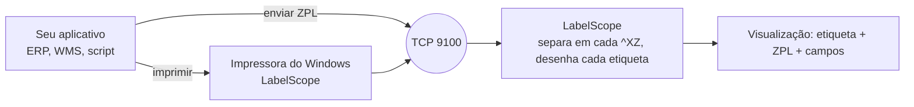

<p align="center">
  🌎 <a href="README.md">English</a> · <a href="README.es.md">Español</a> · <strong>Português</strong> · <a href="README.fr.md">Français</a>
</p>

<p align="center">
  
</p>

<h1 align="center">LabelScope</h1>

<p align="center">
  <strong>Uma impressora de etiquetas Zebra® virtual para Windows.</strong><br>
  Envie ZPL de qualquer programa. Veja a etiqueta na tela, encontre os problemas e economize papel.
</p>

<p align="center">
  <a href="https://github.com/P4Software/LabelScope/releases/latest"></a>
  <a href="LICENSE"></a>
  
  <a href="https://github.com/P4Software/LabelScope/releases"></a>
</p>

<p align="center">
  <a href="https://github.com/P4Software/LabelScope/releases/latest/download/LabelScope-Setup.exe"><strong>Baixar LabelScope-Setup.exe</strong></a>
  &nbsp;·&nbsp;
  <a href="https://github.com/P4Software/LabelScope/releases/latest">Todas as versões</a>
  <br>
  <sub>Versão 0.4.1 · Windows 10 ou 11, 64 bits · grátis · não precisa de direitos de administrador para instalar</sub>
</p>

---

## Por que o LabelScope

**Veja cada etiqueta antes que ela seja impressa.**
Sistemas de armazém, expedição e varejo imprimem etiquetas enviando texto ZPL para uma impressora Zebra. O LabelScope se faz passar por essa impressora. A sua etiqueta aparece na tela em segundos, ao lado do ZPL que a desenhou. Sem rolo de etiquetas, sem papel desperdiçado.

**Encontre os problemas antes que eles custem caro.**
Um código de barras que passa da borda da etiqueta não será lido. O LabelScope o contorna em vermelho e explica o motivo, em palavras simples. Cada comando que ele não consegue desenhar aparece na lista com o número da linha, em vez de falhar em silêncio.

**Funciona sem internet. Grátis. Assinado.**
As etiquetas são desenhadas no seu PC. Nada é enviado para fora, nada é cobrado por uso. O instalador é assinado digitalmente, é gratuito sob a licença MIT e não precisa de direitos de administrador.

---

## O que você ganha

### Clique em um campo e encontre a linha do ZPL

A aba **Campos** lista tudo o que o LabelScope desenhou: textos, códigos de barras, caixas, círculos, linhas e gráficos, cada um com posição, tamanho, fonte e linha do ZPL. Clique em um campo na etiqueta, em uma linha da lista ou em uma linha do ZPL, e os três selecionam a mesma coisa.

<p align="center">
  
</p>

### Saiba quando um código de barras não será lido

Quando um código de barras passa da etiqueta, o LabelScope desenha um contorno vermelho em volta dele e diz, em palavras simples, o que está errado, o que fazer e qual linha é a responsável. O cartão do trabalho à esquerda também fica vermelho, então você vê o problema antes de abrir a etiqueta.

<p align="center">
  
</p>

### Configure uma vez, em uma só tela

**Configurar impressora** reúne o que quase todo mundo precisa: o nome da impressora do Windows com um botão **Reinstalar impressora**, o tamanho da etiqueta (nove tamanhos comuns ou o seu, em milímetros), a densidade de impressão (203, 300 ou 600 dpi), o idioma, se cada trabalho novo é mostrado assim que chega e se os trabalhos são mantidos depois que você fecha o LabelScope.

<p align="center">
  
</p>

### Em português, inglês, espanhol e francês

Escolha English, Español, Português (Brasil) ou Français na barra de ferramentas, ou deixe o LabelScope seguir o idioma do Windows. Todos os textos mudam, inclusive os avisos e as mensagens que dizem o que deu errado e o que fazer em seguida. Os trabalhos que já estão na tela são desenhados de novo no idioma escolhido.

<p align="center">
  
</p>

### Cada trabalho de impressão, um cartão

Cada envio do seu sistema vira um cartão, o mais recente primeiro, com a hora, o remetente, o número de etiquetas e "Desenhada corretamente" ou o primeiro problema. Um trabalho com várias etiquetas mostra *Etiqueta 1 de 3* com setas para navegar entre elas. Ative **Conservar os trabalhos ao fechar o LabelScope** e a sua lista continua lá amanhã.

<p align="center">
  
</p>

### E também

- **Etiqueta e ZPL lado a lado**, com os comandos coloridos e números de linha. A aba **Registro** anota o que aconteceu com cada trabalho.
- **Abrir arquivo ZPL** e **Colar ZPL** para conferir uma etiqueta sem enviar nada.
- **O tamanho da etiqueta vem primeiro do ZPL.** `^PW` e `^LL` têm prioridade; se a etiqueta não envia nenhum, o LabelScope usa o tamanho que um trabalho anterior enviou e, depois, a etiqueta carregada em Configurar impressora (também na lista de tamanhos da barra de ferramentas).
- **Salvar como PNG** ou copiar a etiqueta como imagem. O tamanho da etiqueta aparece em polegadas e pontos.
- **Memória da impressora** como numa impressora real: gráficos, fontes e configurações enviados em um trabalho ficam disponíveis para o próximo.
- **Atualização dentro do aplicativo** e um **registro de falhas** (crash log) se algo der errado.

---

## Comece em 60 segundos

1. **[Baixe o LabelScope-Setup.exe](https://github.com/P4Software/LabelScope/releases/latest/download/LabelScope-Setup.exe)** e execute-o. Ele é instalado só para o seu usuário.
2. Abra o **LabelScope** pelo menu Iniciar.
3. Abra **Configurar impressora** e clique em **Reinstalar impressora**, ou use o menu **...** e escolha **Instalar impressora**. Responda **Sim** quando o Windows perguntar. Este é o único passo que precisa de permissão de administrador.
4. Imprima de qualquer programa na impressora chamada **LabelScope**, ou envie ZPL para `127.0.0.1` porta `9100`.
5. O trabalho aparece à esquerda e a etiqueta no meio. Clique nele, clique em um campo, leia o ZPL.

Não tem ZPL à mão? Clique em **Colar ZPL** e cole isto:

```zpl
^XA
^FX Shipping label
^PW812^LL406
^FO50,50^A0N,60,60^FDHello LabelScope^FS
^FO50,140^GB700,4,4^FS
^FO50,180^BY3^BCN,100,Y,N,N^FD12345678^FS
^XZ
```

Ou envie pelo PowerShell:

```powershell
$zpl = "^XA^FO50,50^A0N,60,60^FDHello LabelScope^FS^FO50,150^GB400,4,4^FS^XZ"
$client = New-Object Net.Sockets.TcpClient("127.0.0.1", 9100)
$bytes = [Text.Encoding]::UTF8.GetBytes($zpl)
$client.GetStream().Write($bytes, 0, $bytes.Length)
$client.Close()
```

Para remover a impressora depois, use **Remover impressora** no menu **...**. O LabelScope só remove uma impressora que ele mesmo criou.

---

## Como funciona



- A impressora do Windows usa o driver **Generic / Text Only** que vem com o Windows, então nos trabalhos de impressão brutos (raw) o ZPL chega ao LabelScope sem alterações.
- Programas que falam TCP pulam a impressora e enviam direto para a porta **9100**, a porta padrão das impressoras de etiquetas em rede.
- O desenho acontece **dentro do LabelScope**. Não há nenhum serviço on-line.

---

## ZPL compatível

O LabelScope desenha o que entende e **avisa sobre todo o resto**. O objetivo das próximas versões é a compatibilidade total com ZPL.

| Grupo | Comandos |
|---|---|
| Etiqueta e campos | `^XA ^XZ ^PW ^LL ^LH ^LR ^PO ^PQ ^FO ^FT ^FD ^FS ^FW ^FH ^FB ^FR ^FX ^CF` |
| Conjuntos de caracteres | `^CI`: `^CI28` (UTF-8) e os outros conjuntos Unicode 29 e 30 são desenhados como uma impressora os imprime. `^CI0` a `^CI27` e 31 a 36 são exatos para texto ASCII simples |
| Texto e fontes | `^A` com as fontes `0`, `A` a `H` e `P` a `V`; `^A@` e `^CW` com as suas próprias fontes |
| Formas | `^GB ^GC ^GD` |
| Códigos de barras | `^BY ^BC ^B3 ^BL ^BA ^BE ^BU ^B8 ^B9 ^B2 ^BK ^B1 ^BM ^BQ ^BX ^B7`: Code 128, Code 39, LOGMARS, Code 93, EAN-13, UPC-A, EAN-8, UPC-E, Interleaved 2 of 5, Codabar, Code 11, MSI, QR Code, Data Matrix, PDF417 |
| Gráficos | `^GF` (hexadecimal ASCII, compactação Zebra, Z64, B64), `~DG ~DY ^XG ^IM ^IL ^IS ^ID ~DN` |

**Ainda não.** Estes mostram um aviso e são ignorados, e são os primeiros da fila para a próxima versão:

- Formatos armazenados e contadores: `^DF` / `^XF`, `^SN`, `^FV`.
- Conjuntos de caracteres: letras acentuadas e outras letras não ASCII nas páginas de código de um byte (`^CI0` a `^CI27`, 31 a 36, como a CP850) ainda estão sendo completadas. Uma etiqueta assim mostra um aviso com o nome do conjunto.
- Códigos de barras: `^BI ^BJ ^BP ^BS ^B5 ^BZ ^BR ^BD ^B0 ^BO ^B4 ^BB ^BT ^BF` (industrial 2 of 5, Plessey, complementos, códigos postais, GS1 DataBar, MaxiCode, Aztec, Code 49, CODABLOCK, TLC39, MicroPDF417).
- Gráficos: dados binários (`^GF` e `~DY` formato B), a compactação AR da Zebra (formato C), fontes bitmap carregáveis (`~DB`). `~EG` mostra um aviso; use `^ID`.

Alguns comandos que mudam o comportamento da impressora, mas não a imagem (`^MN ^MM ^MD ^MT ^PR ^JU`), são ignorados sem aviso.

### Limites que vale a pena conhecer

- **As fontes são aproximadas na forma e exatas no tamanho.** As fontes da própria Zebra são licenciadas e não podem ser distribuídas, então o LabelScope desenha as fontes A a H com os tamanhos de célula da Zebra, e a fonte 0 e P a V com a Noto Sans ExtraCondensed Bold posicionada e dimensionada como a fonte 0 da Zebra. As maiúsculas começam na linha do `^FO` e têm a mesma altura que numa impressora, e o comprimento das linhas fica dentro de cerca de 2%. O formato das letras é diferente. As fontes OCR E e H são desenhadas com uma fonte simples de largura fixa. Caracteres que uma fonte não tem são impressos como espaços, com um aviso. O LabelScope é uma ferramenta de visualização, não um substituto exato, pixel a pixel, de uma impressora.
- **Códigos de barras e gráficos são desenhados pelas regras publicadas e ainda não foram comparados com uma impressora Zebra real.** Eles são decodificados corretamente por um decodificador independente, mas pequenos detalhes podem diferir: a margem em branco em volta de um símbolo, o tamanho escolhido para o PDF417 quando a etiqueta não informa colunas e linhas, ou o tamanho dos dígitos embaixo do EAN/UPC. No PDF417 a altura da linha (`h`) é tomada em pontos; uma impressora pode multiplicá-la pela largura do módulo. Sempre teste a leitura de uma etiqueta importante na sua impressora real.
- **A memória da impressora dura enquanto o LabelScope está aberto.** Gráficos e fontes enviados com `~DG`, `~DY` ou `^IS`, e letras de fonte definidas com `^CW`, ficam guardados, como na unidade R: de uma impressora, até você fechar o LabelScope ou clicar em **Limpar memória da impressora** (no menu **...**), até 64 MB ou 1000 objetos. Uma etiqueta que usa um gráfico que o LabelScope nunca recebeu é desenhada sem ele, com um aviso que cita o arquivo.
- **O tamanho da etiqueta vem do ZPL.** A largura é `^PW` e o comprimento é `^LL`, da própria etiqueta ou de um trabalho anterior; os programas de etiquetas costumam enviá-los uma vez em um trabalho de configuração, e o LabelScope os mantém (com `^LH`, `^PO` e `^LR`) como uma impressora faz. Quando o ZPL nunca informa um tamanho, o LabelScope usa a etiqueta carregada em Configurar impressora ou escolhida na lista de tamanhos da barra de ferramentas (4 x 6 pol. a 203 dpi para começar). O tamanho é limitado a 8000 pontos por lado e 40 milhões de pontos no total, com um aviso.
- **`^BY`, `^FW` e `^CF` valem para uma só etiqueta.** Cada etiqueta começa com as configurações iniciais da impressora, então repita o comando em cada etiqueta que precisar dele.
- **Dados gráficos binários e separação de trabalhos.** O LabelScope separa um envio em cada `^XZ`, mesmo dentro de dados gráficos binários. Por enquanto, envie os gráficos em hexadecimal ASCII ou Z64.
- **O `^GF` é pintado onde está escrito.** Um `^FR` escrito depois do `^GF` no mesmo campo não o inverte; coloque o `^FR` antes do `^GF`.
- **O valor de verificação dos gráficos Z64 e B64 não é conferido.** A Zebra não publica o método. Os dados Z64 continuam sendo conferidos pela soma de verificação da própria compactação e pelo tamanho.
- **Detalhes dos códigos de barras.** Data Matrix com qualidade 0 a 140 é desenhado como o tipo moderno ECC 200, com um aviso. Os identificadores de aplicação GS1 no modo D do Code 128 não são validados. Dados QR com letras acentuadas são enviados como Latin-1 quando todos os caracteres cabem, enquanto uma impressora configurada em UTF-8 envia UTF-8; os dois são lidos, mas os bytes lidos podem ser diferentes.
- **Codificação do texto.** Cada etiqueta é lida primeiro como UTF-8 e, se não for UTF-8 válido, como Windows-1252. Etiquetas com `^CI28` desenham as letras acentuadas exatamente. Com um conjunto `^CI` de um byte, o texto ASCII simples é exato; outras letras podem ser diferentes das da impressora e a etiqueta avisa isso com um aviso. Uma etiqueta que anuncia `^CI28` mas não envia UTF-8 também recebe um aviso.
- **Velocidade.** Etiquetas do dia a dia aparecem na hora, e um envio de 5000 etiquetas é desenhado em cerca de 16 segundos. Uma etiqueta que posiciona dezenas de gráficos em tamanho real pode levar vários segundos. Um campo de texto com mais de 65536 caracteres é cortado, com um aviso. Uma única etiqueta com mais de 16 MB sem `^XZ` é descartada, com uma mensagem.
- **Cantos arredondados em `^GB` são desenhados retos**, com um aviso.

---

## Configurar impressora e configurações

Abra **Configurar impressora** na barra de ferramentas. Clique em **Salvar** e a mudança vale na hora; tamanho, densidade e idioma redesenham os trabalhos que já estão na tela.

| Opção | O que faz |
|---|---|
| Nome da impressora | O nome da impressora do Windows. No máximo 60 caracteres, sem `* ? [ ] \ / !`. Um nome novo passa a valer quando você clica em **Reinstalar impressora**. |
| Tamanho da etiqueta | Nove tamanhos comuns, ou **Personalizado** em milímetros (5 a 2000). Usado só quando o ZPL não informa `^PW` / `^LL`. |
| Densidade de impressão | 203, 300 ou 600 dpi. |
| Idioma | Idioma do Windows, inglês, espanhol, português (Brasil) ou francês. |
| Mostrar na hora cada trabalho recebido | Ligado por padrão. Desligue para continuar vendo o trabalho que você selecionou. |
| Conservar os trabalhos ao fechar o LabelScope | Desligado por padrão. Quando ligado, os seus trabalhos voltam na próxima inicialização (guardados em `%LocalAppData%\LabelScope`). |

O LabelScope marca a impressora que cria. Ele nunca altera nem remove uma impressora que não criou, mesmo que o nome seja igual. A impressora encaminha para `127.0.0.1` na porta de escuta, então, se você mudar a porta, reinstale a impressora.

### Avançado: settings.json

O `settings.json` fica ao lado do programa e é criado na primeira inicialização com uma explicação para cada opção. Se um valor estiver errado, o LabelScope usa um padrão seguro e diz qual configuração corrigir. O arquivo pode ter comentários `//`. Edite-o só para as chaves abaixo e depois reinicie o LabelScope.

| Configuração | Padrão | Significado |
|---|---|---|
| `ListenAddress` | `127.0.0.1` | `127.0.0.1` aceita etiquetas só deste computador; `0.0.0.0` também as aceita da rede. Nenhum outro valor é aceito. |
| `ListenPort` | `9100` | Porta para o ZPL recebido, de 1 a 65535. Mude se outro programa já usa a 9100. |
| `HistoryLimit` | `100` | Quantos trabalhos manter na lista, de 1 a 1000. |
| `FontsFolder` | vazio | Pasta com as suas próprias fontes TrueType (`.ttf`) ou OpenType (`.otf`). Uma etiqueta que cita um arquivo de fonte com `^A@` ou `^CW` (por exemplo `E:ARIAL.TTF`) usa o arquivo com o mesmo nome desta pasta. |
| `LogFolder` | `logs` | Onde os arquivos de log são gravados. Uma pasta relativa é relativa à pasta do programa. |
| `CheckForUpdates` | `true` | Pergunta ao GitHub uma vez na inicialização se existe uma versão mais nova. O LabelScope só avisa; ele instala uma versão nova quando você clica em **Atualizar**. |
| `ShowGrid` / `StackedLayout` | `false` | Começar com uma grade leve de 10 mm sobre a etiqueta, ou com o ZPL embaixo da imagem. Também no menu **...**. |

Mantenha o LabelScope em uma pasta em que você possa gravar, como a que o instalador usa, e não em `Program Files` se você executar uma compilação copiada: ele grava o `settings.json` e a pasta `logs` ao lado de si mesmo. Escutar em `0.0.0.0` pode fazer o Windows mostrar uma pergunta do firewall, e responder a ela exige um administrador.

---

## Perguntas frequentes e solução de problemas

| Problema | O que fazer |
|---|---|
| "A porta 9100 já está sendo usada por outro programa" | Outro programa (ou um segundo LabelScope) usa a porta. Feche-o, ou defina outra `ListenPort` no `settings.json`, inicie o LabelScope novamente e reinstale a impressora. A linha de status mostra o problema em vermelho até ele ser resolvido. |
| "O LabelScope não conseguiu começar a escutar em ..." | Verifique `ListenAddress` e `ListenPort` no `settings.json`. |
| "O Windows pediu permissão e ela não foi concedida, então nada foi alterado" | A pergunta foi recusada. Tente novamente e escolha **Sim**. |
| "Já existe uma impressora chamada ... que não foi criada pelo LabelScope" | O LabelScope não mexe em impressoras que não criou. Escolha outro nome em **Configurar impressora**. |
| "A impressora não pôde ser instalada: ..." ou "não conseguiu verificar quais impressoras estão instaladas" | Verifique se o serviço "Spooler de Impressão" do Windows está em execução e tente novamente. Se continuar falhando, mostre a mensagem ao seu administrador. Os detalhes estão no log. |
| Um trabalho com o título "Nenhuma etiqueta encontrada" | Os dados que chegaram não tinham um bloco `^XA ... ^XZ` (por exemplo uma consulta de status, ou um documento comum impresso na impressora LabelScope). O texto aparece na aba ZPL. |
| Um trabalho com o título "Etiqueta não desenhada" | Os dados tinham um início de etiqueta (`^XA`), mas nada pôde ser desenhado a partir deles. Veja a aba **Registro**. |
| Um código de barras tem contorno vermelho | Ele passa da etiqueta ou é largo demais para o espaço, então não será lido. Mova-o, encurte os dados ou use uma largura de módulo menor em `^BY`. |
| "O LabelScope está ocupado: há programas demais enviando etiquetas ao mesmo tempo" | Mais de 16 programas estavam conectados ao mesmo tempo. Espere um pouco e envie de novo. |
| "O arquivo de configurações não pôde ser lido ..." | Há um erro de digitação no `settings.json`. Corrija-o, ou apague-o para obter um novo, e reinicie. Enquanto isso, são usadas as configurações padrão. |
| "Uma etiqueta de mais de 16 MB foi recebida sem marca de fim (^XZ) e foi descartada" | O remetente não está enviando etiquetas de verdade, ou nunca envia `^XZ`. Verifique o programa que envia as etiquetas. |
| "Uma etiqueta chegou incompleta (sem ^XZ no final)" | O remetente se desconectou antes de enviar `^XZ`. A etiqueta é exibida até onde chegou. |
| Uma etiqueta parece diferente da impressora real | As fontes são aproximadas na forma e alguns comandos ainda não são compatíveis. Veja a aba **Registro**. |
| O LabelScope fechou sozinho, ou mostrou "O LabelScope encontrou um erro inesperado" | Os detalhes técnicos estão em `crash.log`, na pasta `logs` ao lado do programa, ou em `%LocalAppData%\LabelScope\logs` se essa pasta for somente leitura. O arquivo pode conter caminhos de arquivos, inclusive o seu nome de usuário do Windows, então confira-o antes de enviá-lo por e-mail. |
| Outra coisa | Abra o menu **...**, escolha **Abrir pasta de logs** e veja o arquivo mais recente. |

---

## Privacidade e segurança

- As etiquetas são desenhadas localmente e nunca saem do seu computador. A única solicitação à internet que o LabelScope faz é uma pequena pergunta ao GitHub na inicialização ("existe uma versão mais nova?"). Ele não envia nada sobre você nem sobre as suas etiquetas. Defina `CheckForUpdates` como `false` para desligar até isso.
- Por padrão, o LabelScope escuta só em `127.0.0.1`, então outros computadores não conseguem alcançá-lo. Defina `ListenAddress` como `0.0.0.0` só em redes de confiança: qualquer pessoa que alcance a porta pode enviar etiquetas para ele.
- O programa nunca é executado como administrador. Só instalar ou remover a impressora pede permissão ao Windows.
- O LabelScope nunca altera nem remove uma impressora que não criou.
- O instalador é assinado digitalmente. Uma atualização baixada tem a assinatura do editor conferida antes de ser executada.
- Se você ativar **Conservar os trabalhos ao fechar**, o ZPL dos seus trabalhos é salvo em um arquivo no seu PC. Desative se as etiquetas tiverem dados que você não quer guardar.

---

## Compilar a partir do código-fonte

Você precisa do Windows 10 ou 11 e do [SDK do .NET 10](https://dotnet.microsoft.com/download/dotnet/10.0) ou mais novo.

```powershell
git clone https://github.com/P4Software/LabelScope.git
cd LabelScope
dotnet build
dotnet run --project src/LabelScope.App
```

Se a restauração de pacotes falhar por causa de uma origem do NuGet com defeito ou inacessível, adicione a origem pública:

```powershell
dotnet build -p:RestoreSources=https://api.nuget.org/v3/index.json
```

Compilação autocontida (nada para instalar no computador de destino):

```powershell
dotnet publish src/LabelScope.App -c Release -r win-x64 --self-contained -o publish/win-x64
```

Copie `publish/win-x64` para qualquer PC com Windows 10 ou 11 e clique duas vezes em `LabelScope.exe`.

```
src/LabelScope.Core/    Configurações, receptor TCP, leitor e desenho de ZPL, instalador da impressora (sem interface)
src/LabelScope.App/     O aplicativo do Windows (WPF)
installer/              Script do Inno Setup e a compilação que cria e assina o instalador
assets/                 Logotipo, ícone e capturas de tela
```

---

## Planos

- [x] **0.2.0** Códigos de barras e texto girado
- [x] **0.3.0** Gráficos, imagens e fontes próprias; instalador assinado
- [x] **0.4.0** Janela nova, aba Campos, aviso em vermelho para códigos de barras que não serão lidos, interface completa em espanhol, Configurar impressora, conservar trabalhos
- [x] **0.4.1** Português (Brasil) e francês
- [ ] **0.5** ZPL completo: as páginas de código `^CI` restantes, `^DF` / `^XF`, `^SN`, `^FV`, os códigos de barras restantes, gráficos binários
- [ ] Comparação de códigos de barras e gráficos com uma impressora Zebra real
- [ ] Opcional: salvar automaticamente cada etiqueta recebida em arquivos PDF ou de imagem

---

## Como contribuir

Relatos de erros e pedidos de recursos são bem-vindos em [Issues](https://github.com/P4Software/LabelScope/issues). O relato mais útil inclui o ZPL que é desenhado errado (remova antes qualquer dado privado) e, se possível, uma foto do que a sua impressora imprime.

---

## Licença e créditos

O LabelScope é software livre da [P4 Software](https://github.com/P4Software) sob a [licença MIT](LICENSE): você pode usar, copiar, alterar e compartilhar, inclusive em trabalhos comerciais, desde que o aviso de copyright e o texto da licença o acompanhem.

Ele usa SkiaSharp, Serilog, ZXing.Net, AvalonEdit e o runtime do .NET, e dá crédito à biblioteca geradora de QR Code do Project Nayuki. As fontes integradas da Zebra são desenhadas com as fontes incluídas Noto Sans ExtraCondensed Bold e IBM Plex Mono (SIL Open Font License 1.1). Todas as licenças e avisos de copyright estão em [THIRD-PARTY-NOTICES.txt](THIRD-PARTY-NOTICES.txt), que também é instalado ao lado do `LabelScope.exe`.

Zebra® e ZPL® são marcas registradas da Zebra Technologies Corporation. O LabelScope é um produto independente e não é afiliado nem endossado pela Zebra Technologies.
